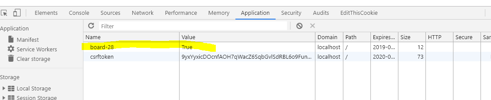

# Cookie

### set

```python
response = render(request,"main.html")
response.set_cookie(f'board-{id}', True, max_age=60*60) # 1시간 동안 유효.
return response
```


### expire

`max_ag`는 현재로부터 N시간 이후 쿠키 값이 없어진다. `expire`는 쿠키가 없어지는 특정 때를 정한다.

```python
tomorrow = datetime.datetime.replace(datetime.datetime.now(), hour=23, minute=59, second=0)
expires = datetime.datetime.strftime(tomorrow, "%a, %d-%b-%Y %H:%M:%S GMT")
 response.set_cookie(str(authuser['id']), str(id), expires =expires)
```


### get

```python
request.COOKIE[id]
request.COOKIE.get(id)
```


### delete

```python
response.delete_cookie(id)
```


개발자 모드에서 확인할 수 있다.




[https://ssungkang.tistory.com/entry/Django%EB%A1%9C%EA%B7%B8%EC%9D%B8-%EC%9C%A0%EC%A7%80%ED%95%98%EA%B8%B0-%EC%BF%A0%ED%82%A4%EC%99%80-%EC%84%B8%EC%85%98](https://ssungkang.tistory.com/entry/Django로그인-유지하기-쿠키와-세션)