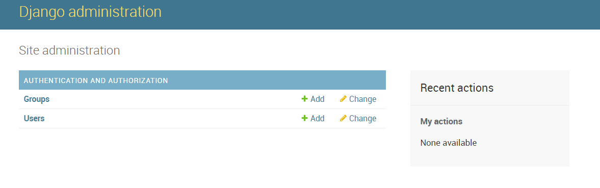

# admin

### 관리자 생성

> python3 manage.py createsuperuser

### admin 페이지



기본으로 장고에서 제공하는 `Groups`와 `Users`테이블을 포함하여 앞으로 만들 db 테이블에 대한 데이터의 입력, 변경, 삭제 등이 가능한 페이지이다.


### admin 사이트에 테이블 반영

```python
# admin.py

from django.contrib import admin
from polls.models import Question, Choice

admin.site.register(Question)
admin.site.register(Choice)
```

`models.py` 모듈에서 정의한 클래스를 `admin.site.register()` 함수를 사용하여 등록해 준다.

이와 같이 테이블을 새로 만들떄는 model을 정의한 파일과 admin파일을 함께 수정 해야 한다.


### 예시

```python
class PostAdmin(admin.ModelAdmin):
    list_display = ('title', 'modify_date')
    list_filter = ('modify_date',)
    search_fields = ('title', 'content')
    prepopulated_fields = {'slug': ('title',)}
```

- PostAdmin
  - Post 클래스가 Admin 사이트에서 어떤 모습으로 보여 줄지를 정의하는 클래스
- list_display
  - Post 객체를 보여줄 때 title과 modify_date를 화면에 출력하라고 지정합니다.
- list_filter
  - modify_date 컬럼을 사용하는 필터 사이드바를 보여주도록 지정
- search_fields
  - 검색 박스를 표시하고 입력된 단어는 title과 content 컬럼에서 검색하도록 합니다.
- slug
  - title필드를 사용해 미리 채워지도록 한다.