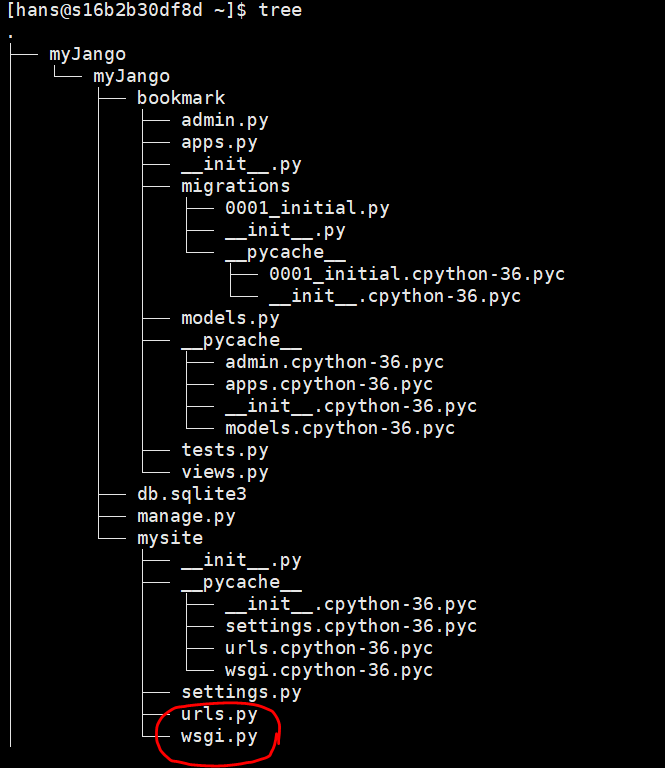
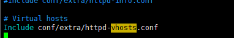
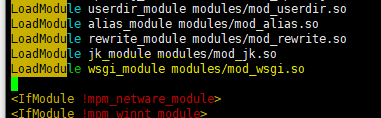

# apache

1. `$ yum install httpd`

2. `$ yum install mod_wsgi`

3. .conf 파일 생성

   /etc/httpd/conf.d 디렉토리 아래에 .conf 파일을 만든다.

   etc/httpd/httpd.conf에 추가해도 상관없지만 관리가 쉽도록 새로운 파일을 만든다.

   ```xml
   <VirtualHost *:80>
           WSGIScriptAlias / /myJango/myJango/mysite/wsgi.py
           <Directory /myJango/myJango/mysite>
           <Files wsgi.py>u
                   Order deny,allow
                   Allow from all
           </Files>
           </Directory>
   </VirtualHost>
   ```

   

   - 80 port로 들어오는 url의 /아래 모든 요청은 /myJango/myJango/mysite/wsgi.py를 호출하게 된다.
   - wsgi.py파일은 모든 접근을 allow한다.

4.  wsgi.py 파일 수정

   ```python
   import os, sys
   
   from django.core.wsgi import get_wsgi_application
   
   path = os.path.abspath(__file__+'/../..')
   if path not in sys.path:
   	sys.path.append(path)
   
   os.environ.setdefault('DJANGO_SETTINGS_MODULE', 'mysite.settings')
   
   ```

   


## in bit


### apache vhost 설정 ( port 기준 )

- 도메인 기준 ( 같은 port, 다른 도메인 )
- port 기준 ( 다른 port, 다른 도메인 ) : apache 멀티포트 서비


httpd.conf 파일에서

1. httpd.com

   1.  Listen [원하는 포트] 추가

2. DocumentRoot 디렉터리 권한 설정 주석 처리

3. Virtual Host 설정 주석 해제

   

4. `httpd-vhosts.conf` 파일에서

   ```sh
   #
   # Use name-based virtual hosting.
   #
   NameVirtualHost *:80
   NameVirtualHost *:8888
   
   #
   # VirtualHost example:
   # Almost any Apache directive may go into a VirtualHost container.
   # The first VirtualHost section is used for all requests that do not
   # match a ServerName or ServerAlias in any <VirtualHost> block.
   #
   <VirtualHost *:80>
       ServerAdmin webmaster@dummy-host.example.com
       DocumentRoot "/usr/local/apache/htdocs"
       ServerName dummy-host.example.com
       ServerAlias www.dummy-host.example.com
       ErrorLog "logs/localhost.80-error_log"
       CustomLog "logs/localhost.80-error_log" common
       <Directory "/usr/local/apache/htdocs">
           Options Indexes FollowSymLinks
           AllowOverride None
           Order allow,deny
           Allow from all
       </Directory>
       JkMountFile conf/uriworkermap.properties
   </VirtualHost>
   
   <VirtualHost *:8888>
       ServerAdmin webmaster@dummy-host2.example.com
       DocumentRoot "/home/django/python_ch3"
       ErrorLog "logs/localhost.80-error_log"
       CustomLog "logs/localhost.80-error_log" common
       WSGIScriptAlias / /home/django/python_ch3/python_ch3/wsgi.py
       WSGIDaemonProcess python_ch3 python-path=/home/django/python_ch3/python_ch3
       <Directory "/home/django/python_ch3/python_ch3">
           <Files wsgi.py>
               Options Indexes FollowSymLinks
               AllowOverride None
               Order allow,deny
               Allow from all
           </Files>
       </Directory>
   </VirtualHost>
   
   ```


### apache - django 연동하기

1. mod_wsgi 설치

   https://github.com/GrahamDumpleton/mod_wsgi/archive/4.6.4.tar.gz

2. `# ./configure --with-apxs=/usr/local/apache/bin/apxs --with-python=/usr/local/cafe24/python3.7/bin/python3`

3. `# make && make install`

4. httpd.conf 파일에 모듈 등록

   `LoadModule wsgi_module modules/mod_wsgi.so`

   