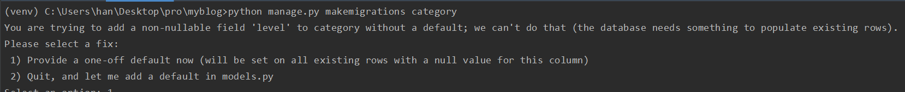

# mptt

계층형 model인 `django-mptt` 라이브러리를 사용해서 계층형 카테고리를 구현해 보자

## install

`# pip install django-mptt`


## settings.py

```python
INSTALLED_APPS = [
    ...
    'mptt',
]
```


## 모델 변경

### 카테고리 model

```python
class Category(MPTTModel):
    name = models.CharField(null=False, max_length=50)
    parent = TreeForeignKey('self', null=True, blank=True, on_delete=models.SET_NULL, db_column='parent')
    orderlv = models.SmallIntegerField(null=True)
    use_tf = models.BooleanField(default=True)
    ...
```

이때 TreeForeignKey 컬럼에 `null=True`와 `blank=True`'를 모두 넣어줘야 부모 값이 없는 컬럼을 넣을 수 있다.

### post model

```python

class Post(models.Model):
    ...
    # category = models.ForeignKey(Category, null=True, on_delete=models.SET_NULL)
    category = TreeForeignKey(Category, null=True, on_delete=models.SET_NULL)
    ...
```


### migrate

나의 경우 마이그레이션할 때 `default` 값을 넣으라는 창이 떳다.



이때 default로 0을 다 집어 넣어줬다.

정확히는 모르겠지만 처음 값을 넣을때 시작할 값인것 같다?!?


### admin에서 트리 구조 반영

```python
# category/admin.py

admin.site.register(Category, DraggableMPTTAdmin)
```


## order by

부모값이 같고, 같은 `level`일때는 카테고리 테이블의 `orderlv`을 통해 ordering을 하고 싶은데, model상에서 `ordering`에서 설정해주니 적용되지 않았다. 그래서 카테고리 select orm을 수행할때 `orderby`를 적용해줬다.

```python
Category.objects.filter(use_tf=True).order_by('tree_id', 'level', 'orderlv')
```


## template

```html



    
        
    
        
    

    <p class="cate category" style="{{ style }}">
        <a href="">
            {{ category.name }}
        </a>
    </p>

```


- <https://wikidocs.net/9725>