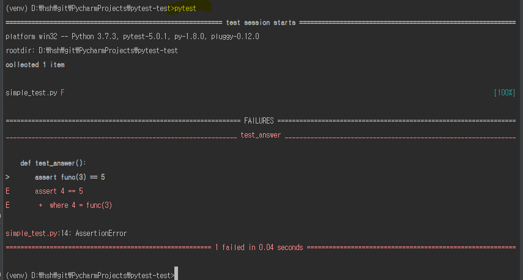

# pytest 기본

### 설치

`# pip install pytest`


### 예제

```python
def func(x):
    return x + 1

def test_answer():
    assert func(3) == 5
```

#### 실행 결과



`# pytest`로 실행한다. 혹은 `# pytest 	파일명`으로도 해당 파일을 실행 할 수 있다.


### pytest에서 해당 test파일을 감지하는 방법

- arg가 없으면 현재 디렉터리에 있는 test파일을 찾는다. 옵션으로 줄 수도 있다.
- `test_*.py`또는 `*_test.py`를 찾는다.
- 위에서 찾은 파일을 바탕으로 아래와 같은 test 요소들을 수집한다.
  - 이름이 `test_`로 시작하는 함수
  - 클래스 이름이 `Test`로 시작하는 클래스 내에서 `test_`로 시작하는 메서드


### @fixture

해당 어노테이션을 사용하면 어노테이션된 함수는 다른 함수의 파라미터로 사용될 수 있다.


<https://wkdtjsgur100.github.io/pytest-description-1/>

