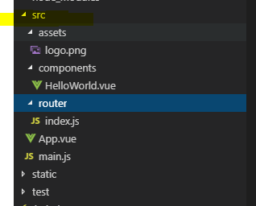

# 시작 하기

`$ npm install vue`

`$ npm install vue-cli`

`$ vue init [template] [프로젝트이름]`

`$ cd [프로젝트이름]`

`$ npm run dev`

- 빌드만

  `$ npm run build`

### `src`폴더를 살펴보자

- assets
  - 이미지 파일
  - css
  - js
- components
  - vue 파일
- router/index.js
  - 서버단에서 해주던 라우터 기능을 프론트 단에서 가능하게 해주는 라우터
- App.vue
  - root 컴포넌트
- main.js
  - 전역 설정을 하기위한 파일 ?