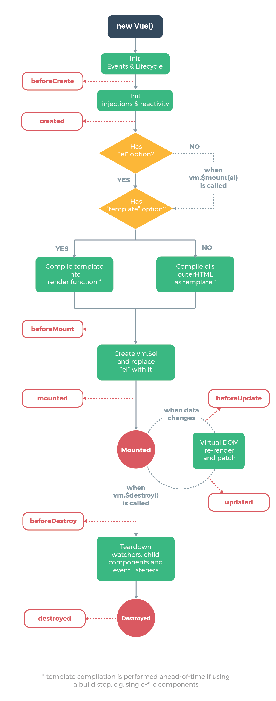

# Life Cycle

각 Vue 인스턴스는 생성될 때 일련의 초기화 단계를 거친다. 그 과정에서 사용자 정의 로직을 실행할 수 있는 **라이프 사이클 훅**도 호출된다. 

```javascript
new Vue({
    data:{
        a:1
    },
    created : function (){
        console.log(this.a);
    }
})
```

`created` 훅은 인스턴스가 생성된 후에 호출된다.

모든 라이프 사이클 훅은 `this` 컨텍스트가 호출하는 Vue 인스턴스를 가리키며 호출된다.




## 1. Creation : 컴포넌트 초기화 단계

라이프 사이클 중에서 가장 처음 실행된다. 이 단계는 컴포넌트가 돔에 추가되기 전이다. 서버 렌더링에서도 지원되는 훅이다.

`befoeCreate`훅과 `Created`훅이 있다.


### beforCreate

```javascript
new Vue ({
    data(){
        return {
            title : 'Vus.js'
        };
    }
    beforeCreate() {
        console.log('beforeCreate');
    }
})
```

가장 먼저 실행되는 훅으로, data와 이벤트(`$on`, `$once`, `$off`, `$emit`), 감시자(`$watch`) 등이 설정 되기 전에 호출된다. :arrow_forward:이 훅에서 사용할 수 없다.

### Created

```javascript
new Vue ({
    data() {
        return {
            title : 'Vue.js'
        };
    },
    computed : {
        titleComputed(){
            return 'After computed : '+this.title;
        }
    },
    created() {
        console.log(this.title, this.titleComputed);
    }
})
```

`data`와 `events`가 활성화 되어 접근할 수 있다.

## 2.Mount : 돔 (DOM) 삽입 단계

컴포넌트가 DOM에 추가 될 때 실행되는 훅. 서버 렌더링에서는 지원하지 않는다.

컴포넌트 초기에 세팅되어야 할 데이터는 `created`단계를 사용하는 것이 더 좋다.

### beforeMount

템플릿과 렌더 함수들이 컴파일된 후에 첫 렌더링이 일어나기 직전에 실행된다.

### mounted

컴포넌트가 DOM에 추가 된 후 호출되는 라이프 사이클 훅.

자신 컴포넌트가 모두 DOM에 추가 된 후에야 부모의 mounted 훅이 실행된다.


## 3. Update

컴포넌트에서 사용되는 속성들이 변경되는 등의 컴포넌트가 재 렌더링 되면 실행되는 훅. 

### beforeUpdate

DOM이 재 렌더링 되기 직전에 호출되는 훅. 업데이트 된 값들을 가지고 있는 상태이기 때문에 업데이트 된 값으로 다른 값들을 업데이트 할 수 있다. 이 훅에서 값이 변경되더라도 다시 `beforeUpdate`훅을 호출 하지는 않는다.

### updated

DOM이 재 렌더링 된 후 호출되는 훅. 이 훅에서 데이터를 수정하면 다시 `update`훅이 호출되기 때문에 무한 루프에 빠질 수 있다!


## 4.Destroy

컴포넌트가 제거 될 때 실행되는 훅.

### beforeDestroy

컴포넌트가 제거 되기 직전에 호출되는 훅. 이벤트 리스너를 해제하거나 할당 받은 자원들을 해제 해야할 때 사용.

### destroyed

컴포넌트가 제거 된 후 호출된다. 


# 렌더링

### SPA : Single Page web Application

브라우저에 로드되고 난 뒤에 페이지 전체를 서버에 요청하는 것이 아닌, 최초 한번 페이지 전체를 로딩한 이후 부터는 데이터만 변경하여 사용할 수 있는 웹을 의미. 