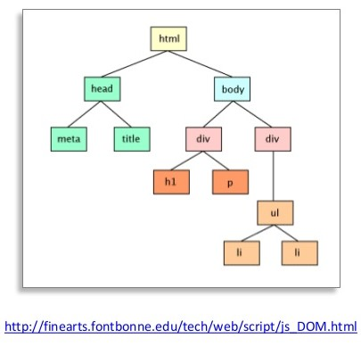

# DOM ( Document Object Model)

웹 브라우저가 html 페이지를 인식하는 방법.

##### DOM Tree



각 노드( == 요소 노드 Element Node )들은 html 태그들 이다! 노드 안에있는 글자는 Text 노드라고 한다. 위의 그림 외에도 script, li등의 태그도 존재한다.

##### JS를 통한 노드 생성

``` javascript
let header= document.createElement('h2');
let text = document.createTextNode('hello');
```

---


### HTML 렌더링

##### 렌더링 이란

문서(html)의 표현식을 그래픽 표현식으로 변형 시키는 과정. 

##### 렌더링 과정

1. 파싱

   문서(html/xml)를 파싱해서 DOM Tree를 만든다.

2. 렌더링 트리를 만든다. --> 그릴때 필요없는 head, title, body, display:none 등의 태크를 없앰.  

3. CSS 결정

4. 레이아웃

   객체들에게 위치와 크기를 정해주는 과정

5. 그리기

   렌더링 트리를 탐색하면서 그린다.

https://12bme.tistory.com/140

https://jeong-pro.tistory.com/90 