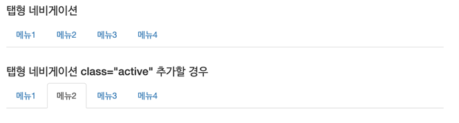

# 네비게이션

- 문서 내부의 메인 메뉴, 서브 메뉴를 만들 때 사용.
- 탭형과 알약형으로 나누어지며, 디자인적인 차이밖에 없다.
- 클래스 조합은 `nav nav-tabs`와 `nav nav-pills`이다.




### 네비게이션 바

- 주 용도는 메인 메뉴를 만들 때 사용.
- 부트스트랩 컴포넌트 중, 가장 중요


- `nav` 태그를 사용하고 `navbar navbar-defalt`조합을 사용한다.
- `nav-header`를 가진 태그는 로고와 모바일 화면에서 메뉴를 나오게 하는 버튼으로 구성된다.
- 데스크탑에서 메뉴가 나오는 부분은 `<div>...</div>`부분이다.
- 메뉴를 오른쪽으로 이동 시키기 위해 `navbar-right` 클래스를 적용한다.


### topfix 적용하기

`navbar-fixed-top` 클래스를 넣어준다.


```html
<div class="container">
    <nav class="navbar navbar-default navbar-fixed-top" role="navigation">
    	<div class="navbar-header">
            <button class="navbar-toggle" data-toggle="collapse">
                
            </button>
            <a class="navbar-brand" href="">로고</a>
        </div>
        
        <div class="collapse navbar-collapse navbar-ex1-collapse">
            <ul class="nav navbar-nav">
                <li><a href="">메뉴1</a></li>
                <li><a href="">메뉴2</a></li>
            </ul>
            
        </div>
    </nav>
    
    <article>
    </article>
    
</div>
```