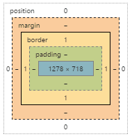

# 박스 모델

##### conent (파랑색 부분)

width와 height가 차지하는 공간.

##### padding

##### board

테두리! padding이 없어도 board가 있을 수 있다.

padding와 board모두 width, height에 포함되지 않는다.

단 `box-sizing:board-box`를 해주면 width와 height는 board를 포함한 크기만큼을 가진다.

##### margin

절대 width, height에 포함되지 않는다! :x:

##### position

`todo`