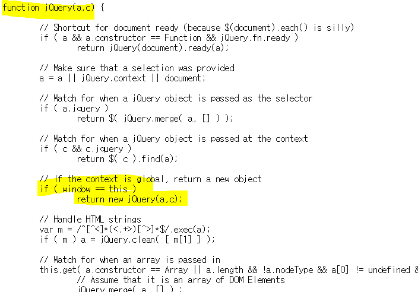

# jQuery 코드 분석


## 소스 코드 구조

#### jQuery 함수 객체

jQuery 라이브러리는 jQuery() 함수 정의부터 시작한다.

가장 중요한 부분은 new 연산자를 이용해 jQuery 객체를 생성하는 것이다.




#### 변수 `####  를 jQuery() 함수로 매핑

일반적으로 jQuery를 사용할 때, jQuery함수를 직접 호출하기 보다는 `$()`와 같은 형태로 jQuery의 기능을 호출한다. 이것이 가능한 이유가 다음과 같이 jQuery함수를 `$`변수에 매핑시켰기 때문이다.

```javascript
let $ = jQuery();
```

