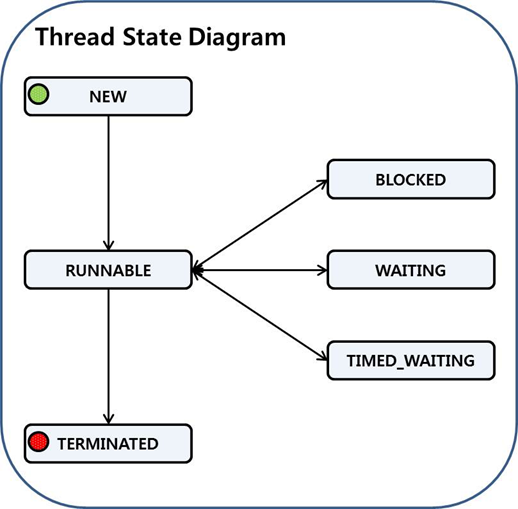

# JVM Sychronization 

> 멀티 스레드 환경에서 공유 자원에 대한 스레드 경합과 동기화에 대해 알아보자.

### 자바와 스레드

WAS에서는 많은 수의 동시 사용자를 처리하기 위해 수십~수백 개의 스레드를 사용한다. 두 개 이상의 스레드가 같은 자원을 이용할 때는 필연적으로 스레드 간에 경합(Contention)이 발생하고 경우에 따라서는 **Dead Lock**이 발생할 수 도 있다.


### 스레드 동기화

> 여러 스레드가 공유자원을 사용할 때, 정합성을 보장하려면 동기화 장치로 **한 번에 하나의 스레드 만 공유 자원에 접근**할 수 있게 해야한다. 자바에서는 **모니터**를 이용해 스레드를 동기화 한다.

- 모든 자바 객체(==인스턴스)는 하나의 **모니터**를 가지고 있다.
- 모니터는 하나의 스레드에 의해서만 소유될 수 있다.
- 특정 스레드가 소유한 모니터를 다른 스레드가 획득하려면 해당 모니터를 소유하고 있는 스레드가 모니터를 해제할 때까지 Wait Queue에서 대기해야 한다.

### Mutual Exclusion ( == 상호 배제)를 하기 위한 동기화

> 둘 이상의 스레드가 동시에 접근하는 것을 막아 주는것. 자바에서는 크게 2가지 방법으로 처리할 수 있다,

- 모든 객체를 대상으로 Lock를 걸 수 있다.  --> 한번에 한 스레드만 객체를 사용하게끔 하는것
- 모든 객체 별로 동기화 처리를 위한 모니터가 결합되어 Lock관리를 수행하게 된다.

- Critical Section
  - 스레드가 동기화가 필요한 지역에 들어가면 동기화를 수행한다. 이 지역을 Critical Section이라고 한다.
  - 스레드가 이 지역에 들어가면 반드시 동기화 작업을 수행한다.
- 스레드가 Critical Section에 진입할 때 동기화를 수행해 Lock를 요청한다.
- Lock을 획득하면 Critical Section에서 작업이 가능하며, Lock획득에 실패하면 Lock을 소유한 다른 스레드가 Lock을 놓을 때까지 대기한다. --> wait set에 들어간다
- Critical Section을 지정해주기만 하면 동기화는 자동으로 된다. 이 영역을 지나면 자동으로 Lock이 풀어 진다.


### 모니터

특정 객체는 하나의 모니터를 가진다. 특정 객체의 모니터에는 동시에 하나의 스레드 만이 들어갈 수 있다. 다른 스레드에 의해 이미 점유된 모니터에 들어가고자 하는 스레드는 모니터의 **wait set**에서 대기한다.

자바에서 모니터를 **점유**하는 유일한 방법은 **Synchronized **키워드를 사용하는 것이다. 


1. Synchronized Statement

   ```java
   public class syn1 extends Thread {
   	private int[] arr = new int[10];
   
   	public void run() {
   		synchronized(this) {
   			for(int i=0 ; i<arr.length; ++i) {
   				arr[i] = i ;
   				System.out.println(arr[i]);
   			}
   		}
   	}
   
   	public static void main(String[] args) {
   		new syn1().run();
   	}
   }
   ```

   해당 Object ( 여기서는 arr )에 대해 모니터를 점유하려는 모든 스레드는 for구문이 실행되는 동안 대기 상태에 빠지게 된다.

2. synchronized Method

   ```java
   synchronized void syncMethod(){
       for(int i=0 ; i<arr.length; ++i) {
   				arr[i] = i ;
   	}
   }
   ```

   함수에 들어가는 순간 critical Section에 들어가게 된다.

   메소드 블럭 전체에 락을 거는 방법으로 메소드에 진입하기 위해서는 메소드를 호출하는 인스턴스의 락을 획득해야 메소드에 진입할 수 있다. 해당 메소드 블럭을 벗어나게 되면 획득한 락을 반환한다.


### Wait 와 Notify

> 무작정 Lock을 선점한 스레드가 Lock을 내놓는 것을 기다리는 것은 상당히 비효율적이다. 이것을 해결하기 위해 나왔다.

- wait와 notify는 동기화된 블록안에서 사용해야 한다.
- 해당 객체의 락에대한 권한을 가지고 있는 쓰레드가 wait()를 만나게 되면 권한을 놓고 대기하게 된다. --> Wait Set으로 간다.
- 이때 notify()를 요청한 스레드는 권한을 얻고, 원하는 수행을 한다. 이 스레드가 권환을 다시 돌려주지 않으면 잠시 Entry Set으로 간 스레드는 권한을 다시 못 가지게 될 수 있다.


### 결과를 예측해 보자

```java
public class ThreadB extends Thread {

     int total;
     @Override
     public void run(){
         synchronized(this){
             for(int i=0; i<5 ; i++){
                 System.out.println(i + "를 더합니다.");
                 total += i;
                 try {
                     Thread.sleep(500);
                 } catch (InterruptedException e) {
                     e.printStackTrace();
                 }
             }
             notify();
   
         }
     }
}
```

### #1 Case

```java
public class ThreadA {
	public static void main(String[] args){

        ThreadB b = new ThreadB();
        b.start();

        synchronized(b){
            System.out.println("Total is: " + b.total);
        }
    }
}
```

### #2 Case

```java
public class ThreadA {
	public static void main(String[] args){

        ThreadB b = new ThreadB();
        b.start();

        synchronized(b){
            b.wait();
            System.out.println("Total is: " + b.total);
        }
    }
}
```

:arrow_forward: main 스레드의 함수가 b.start()보다 먼저 실행하게 되고 먼저 권한을 가진다.


### notify 와 notifyAll

- notify는 객체의 권한을 가질 스레드를 JVM의 정책에 의해 결정되는 것이다. 따라서 개발자는 어떤 스레드가 권한을 가지게 될지 알 수 없다.
- notifyAll은 모든 Wait Set에 있는 권한을 가지고자 하는 스레드끼리 경합을 붙이게 하는것. 이 중 한 스레드만이 권한을 가지고 나머지 스레드는 다시 잠들게 된다.

**:pushpin:Synchronized 키워드를 사용하는 작업은 오버헤드를 따른다. 반드시 필요한 경우에만 사용해야 한다.**

요즘은 성능을 위해 아예 사용하지 않는 추세라고 한다.


## Thread 상태

Thread의 상태는 `Java.lang.Thread` 클래스 내부에 `State`라는 이름을 가진 `Enum`으로 선언되어 있다.



- new

  스레드가 생성됐지만, 아직 실행되지 않은 상태

- runnable

  현재 CPU를 점유하고 작업을 수행중인 상태.  운영체제의 자원 분배로 인해 waiting 상태가 될 수도 있다.

- blocked

  monitor를 획득하기 위해 다른 스레드가 락을 해제하기를 기다리는 상태

- waiting

  wait() 메서드, join() 메서드, park() 메서드 등을 이용해 대기하고 있는 상태.

- timed_waiting

  sleep(), wait(), join(), park() 메서드 등을 이요해 대기하고 있는 상태.

  - waiting 상태와의 차이점은 메서드의 인수로 최대 대기 시간을 명시할 수 있어서, 외부적인 변화 뿐만 아니라 **시간**에 의해서도 waiting 상태가 해제될 수 있다는 것이다.

- terminated

  종료된 상태


### 스레드의 종류 : 데몬 스레드와 비데몬 스레드

사용자가 직접 스레드를 생성하지 않더라도, JAVA 어플리케이션이 기본적으로 여러개의 스레드를 생성한다. 대부분이 **데몬 스레드**인데 가비지 컬렉션이나 JVM등의 작업을 처리하기 위한 것이다.

`'static void main(STring[] args)'

