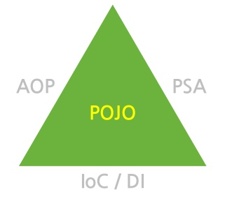

# Spring

- 평범한 자바 클래스(bean)을 이용하여 단순하지만 EJB에서 제공하는 고급 기술을 제공한다.

- EJB와 비교하여 무겁지 않다.

### 주요 전략

1. POJO를 이용한 가볍고 비 침투적 개발.
2. DI와 인터페이스 지향을 통한 느슨한 결합도
3. Aspect와 공통 규약을 통한 선언적 프로그래밍
4. Aspect와 템플릿을 통한 반복적이고 상투적인 코드 제거.

### 컨테이너

- 객체들의 라이프 사이클을 관리
- 컨테이너에서 제공하는 API를 상속받거나 구현하여 코드를 작성하는 부분들을 제거 --> 반복적인 코드의 제거 ----> EJB의 서비스 컨테이너의 기능은 유지해되, 복잡성을 제거한 컨테이너의 필요성.
- ...

### 스프링은 왜 컨테이너를 사용할까 :question:

자바에서 객체를 사용하기 위해서는 `new` 생성자나 `getter`,`setter`기능을 써야만 했다. 한 어플리케이션에는 이러한 객체가 무수히 많이 존재하고 서로 참조하고 있다. 그 정도가 심할 수록 **의존성**이 높다고 표현한다. 이는 자바의 OOP에 맞지 않는 성질이다. 의존성 제어, 즉 객체 간의 의존성을 낮추기 위해 스프링 컨테이너가 사용된다.

[http://www.incodom.kr/spring/%EC%BB%A8%ED%85%8C%EC%9D%B4%EB%84%88](http://www.incodom.kr/spring/컨테이너)

### Bean

- 스프링이 제어권을 가지고 직접 만들고 관계를 부여하는 오브젝트
- 스프링 컨테이너에서 생성된 객체를 Bean이라 한다. 

### POJO

> Plain Old Java Object

- 클래스 :arrow_forward:클래스 하나하나를 POJO라 한다 (예외 O).

### IoC

> Inverse Of Control : 제어 역전

- 인스턴스의 생성부터 소멸까지의 객체 생명 주기 관리를 개발자가 아닌 스프링 컨테이너가 관리한다.
- 스프링 컨테이너는 `Bean`들의 생명 주기를 관리하기 위해 **IoC**를 사용한다. 

### DI

> Dependency Injection

- IoC를 실제로 구현하는 방법으로써, 의존성이 있는 컴포넌트들 간의 관계를 개발자가 직접 코드로 명시하지 않고 스프링이 런타임에 찾아서 연결해주게 하는 것.
- 스프링 컨테이너 중 하나인 **BeanFactory**와 이를 상속한 **ApplicationContext**가 수행한다. ( 두 컨테이너는 같다고 표현할 수 있다.)

 

### 동작 원리

1. 웹 어플리케이션이 실행되면 was에 의해 `web.xml`이 loading된다.
2. web.xml에 등록되어 있는 `ContextLoaderListener ` class가 생성된다. ServletContextListener 인터페이스를 구현하고 있으며, ApplicationContext를 생성한다.
3. ContextLoaderListener는 `root-context.xml`을 loading한다.
4. root-context.xml에 등록되어있는 `스프링 컨테이너`가 구동된다. 이 때 개발자가 작성한 로직에 대한부분, Dao, Vo 객체들이 생성된다.
5. 클라이언트로부터 요청이 들어온다.
6. DispatcherServlet이 생성된다. 이 서블릿은 FrontController의 역할을 수행한다. 요청을 분석하여 알맞은 PageController에게 전달한다. 실질적인 작업은 PageController에서 이루어진다.
7. DispatcherServlet는 servlet-context.xml 을 loading한다.
8. 두번째 스프링 컨테이너가 구동되며 응답에 맞는 PageController들이 동작한다. 이 때, 첫번째 컨테이너가 구동되면서 생성된 Dao, vo 등의 클래스들과 협업하여 알맞은 작업을 처리하게 된다.