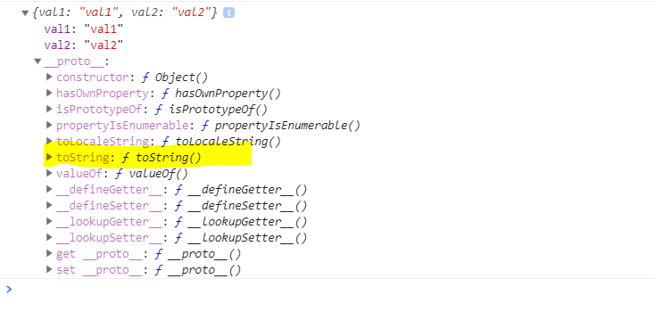
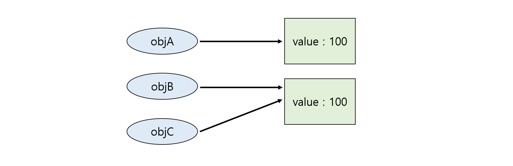

# Class:fire:중요:fire:

를 하기 전에 prototype을 공부하자.

# :hotsprings: Prototype :hotsprings:

- JS는 프로토타입 기반 언어이다:heavy_exclamation_mark:

JS에서 원시타입을 제외한 모든 것들은 객체이다. JS의 모든 객체는 자신을 생성한 객체 원형에 대한 숨겨진 연결을 갖는다. 이때 자기 자신을 생성하기 위해 사용된 객체원형( == 부모객체 )을 프로토타입이라 한다. JAVA에서 Class와 동일한 의미를 가진다.


```javascript
let foo = {
    val1 : "val1",
    val2 : "val2"
}; //이러한 방식으로 객체를 생성하는 것을 객체 리터럴 방식이라 한다.

console.log( foo.toString() );
console.log( foo );
```

foo 객체는 toString() 메서드가 없기 때문에 에러를 발생해야할 것 같지만 정상적으로 결과를 출력한다. 이는 foo 객체의 프로토타입에서 toString()이 정의되어있고 foo객체가 이 메서드를 상속받았기 때문이다.



위와 같이 foo 객체의 `__proto__`(크롬에서 prototype을 표현하는 방법)프로퍼티에 toString() 메서드가 있음을 확인할 수 있다.

여기서 `__proto__` 프로퍼티는 foo객체의 부모인 프로토타입 객체를 가리킨다.

---

## 객체 비교

동등 연산자(==)를 사용하여 두 객체를 비교할 때, 객체의 프로퍼티값이 아닌 참조값을 비교한다.

```javascript
let a = 100;
let b = 100;

let objA = { value:100 };
let objB = { value:100 };
let objC = objB;

console.log( a == b ); // true
console.log( objA == objB ); //false
console.log( objC == objB ); //true
```

`a==b`의 경우 숫자 100을 저장하고 있는 기본 타입 변수다. 기본타입의 경우 동등연산자를 이용해서 비교할 때 값을 비교한다.



`objA == objB`와 `objC == objB`의 경우 객체의 비교에서는 참조값이 같아야 true가 되기 때문이다. 위의 그림과 같인 objB와 objC는 같은 객체를 참조하므로 true가 된다. objB나 objC중 하나의 값이 바뀌게 되면 같은 참조값이 변경되고 두개의 객체 모두에 영향을 끼친다.


### 객체 리터럴 방식과 생성자 함수의 차이

:arrow_forward: 생성자 함수를 통한 객체 생성[ [link](https://github.com/hanseonghye/TIL/blob/master/javascript/%ED%95%A8%EC%88%98.md) ]

- 리터럴 방식의 경우 같은 형태의 객체를 재생성할 수 없다.
- 생성자 함수의 경우 함수를 호출할 때 인자값에 따라 같은 형태의 다른 객체를 생성할 수 있다.
- 프로토타입
  - 리터럴 방식의 경우 프로토타입이 **Object**이다.
  - 생성자 함수의 경우 해당 함수가 프로토타입이다


## call과 apply 메서드를 이용한 명시적인 this 바인딩

내부적인 this 바인딩 ( let that = this )외에도 this를 특정 객체에 명시적으로 바인딩 시키는 방법. 이 메서드들은 모든 함수의 부모 객체인 Function.prototype 객체의 메서드이다.

```javascript
Function.apply(thisArg, argArray);
```

위의 형태로 메서드 호출이 가능하다. call과 apply의 차이는 넘겨받는 인자의 형식 뿐이다.

- thisArg

  apply() 메서드를 호출한 함수 내부에서 사용한 this에 바인딩할 객체를 가리킨다.

- argArray

  함수를 호출할 때 넘길 인자들의 배열

```javascript
function Person(name, age, gender){
    this.name = name;
    this.age = age;
    this.gender = gender;
};

let foo = {};
Person.apply(foo,['foo',30,'male']);
Person.call(foo,'foo',30,'male'); // 위 문장과 같은 수행
```

## 프로토타입의 두 가지 의미

##### prototype과 prototype 프로퍼티

- prototype ( == `__proto__` )

  객체의 부모를 가리키는 프로퍼티

- prototype 프로퍼티

  객체가 생성될 당시 만들어지는 객체 자신의 원형이될 프로퍼티

  

```javascript
function Person(name){
	this.name = name;
};

let foo = new Person('hehe');
console.dir(Person);
console.dir(foo);
```


`

1. Person 생성자 함수의 prototype 프로퍼티

2. Person 생성자 함수의 부모 프로퍼티 ( == prototype )

3. foo 객체의 부모는 Person 함수이다!

   Person() 생성자 함수의 prototype 프로퍼티와 foo 객체의 `__proto__` 프로퍼티가 같은 객체를 가리키고 있는 것을 확인 할 수 있다!

**`__proto__` 프로퍼티는 모든 객체에 존재하는 숨겨진 프로퍼티로 객체 자신의 프로토타입 객체를 가리키는 참조 링크 정보다.**

## 프로토타입 체이닝

JS에서는 자신의 부모 역할을 하는 프로토타입 객체의 프로퍼티 또한 마치 자신의 것처럼 접근할 수 있다. 이것을 **프로토타입 체이닝**이라 한다.

### 체이닝의 종점 : Object.prototype

Object.prototype 객체는 프로토타입 체이니으이 종점이다. 즉 모든 객체는 프로토타입 체이닝으로 Object.prototype 객체가 가진 프로퍼티와 메서드에 접근하고 공유가 가능하다.

- 사용자가 직접 빌트인 프로토타입 객체(Object, String ...)에 메서드를 추가할 수 있다.

  ```javascript
  String.prototype.testMethod = function(){
      console.log('this is the test...');
  };
  
  let str = 'test';
  str.testMethod();
  ```


:sos:인사이드 자바스크립트:book:

