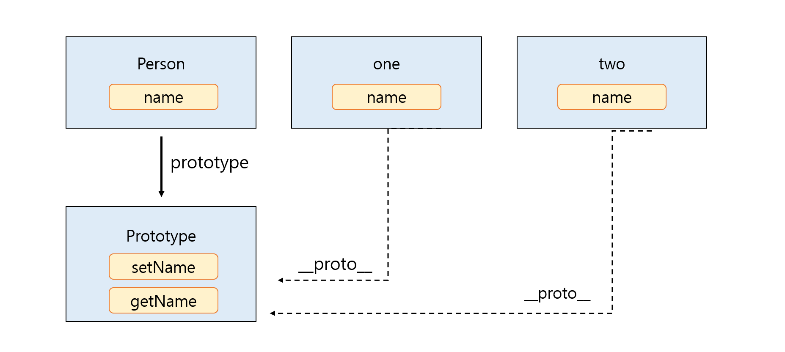

# JS와 객체 지향 프로그래밍

프로젝트의 대형화로 인해 비슷한 함수나 객체를 묶어서 개발할 필요가 생김.

### ~~Apply 와 Call~~

:arrow_forward: 다시 공부해서 작성 [ link ](https://github.com/hanseonghye/TIL/blob/master/javascript/%ED%95%A8%EC%88%98.md)

두 메서드는 같은 기능을 하며 넘겨받는 인자의 형식만이 다르다.

``` javascript
let myMethods = {
    getName : function(){
        return this.name;
    },
    getAge : function(){
        return this.age;
    }
};

let myData = {
    name : 'seonghye',
    age : 20
};

let myCar = {
    name : 'mini',
    age : 2019,
    color : 'blue'
};

console.log (myMethods.getName.apply(myData));
console.log (myMethods.getAge.call(myCar));
```

call은 인자 하나하나(1,2,3,4,5)를 apply는 리스트([1,2,3,4,5])를 전달한다.


### bind

- 문제

  콜백 함수 안에서의 this는 window를 가르킨다. 그럼 어떻게 콜백에서 객체에 접근할 수 있을까 ?

  ``` javascript
  let obj = {
      data : 'dummy',
      time : function(){
          setTimeout(function(){
              console.log(this); // --> window
              console.log(this.data); // undefined
          },1000)
      }
  }
  
  obj.time();
  ```

1. scope 를 활용

   ``` javascript
   let obj = {
       data : 'dummy',
       time : function(){
           let that = this;
           window.setTimeout(function(){
               console.log(that.data); 
           },1000)
       }
   }
   
   obj.time();
   ```

2. bind()

   ``` javascript
   let obj = {
       data : 'dummy',
       time : function(){
           window.setTimeout( function(){
               console.log(this.data);
           }.bind(this),1000)
       }
   }
   
   obj.time();
   ```


https://wayhome25.github.io/javascript/2017/02/18/js-oop-1/


## 클래스, 생성자, 메서드

```javascript
function Person(arg){
    this.name = arg;
    this.getName = function(){
        return this.name;
    };
    this.setName = function(val){
        this.name = val;
    };
};

let one = new Person('one');
let two = new Person('two');
let three = new Person('three');
```

위 코드의 경우 `Person` 함수, `one`,`two`,`three`의 모든 객체에 `getName`과 `setName` 메서드, 그리고 `this.name`에 해당하는 메모리를 가지고 있다. 이렇게 불필요하게 중복되는 영역을 메모리에 올려놓고 사용함으로써 자원낭비를 가져온다.

```javascript
function Person(arg){
    this.name = arg;
};

Person.prototype.getName = function(){
    return this.name;
};

Person.prototype.setName = function(val){
    this.name = val;
};

let one = new Person('one');
let two = new Person('two');
```

`Person` 함수 객체의 prototype 프로퍼티에 getName()과 setName() 함수를 정의하였다. 이 Person으로 객체를 생성한다면 각 객체는 각자 따로 함수 객체를 생성할 필요 없이 setName()과 getName() 함수를 **프로토타입 체인**으로 **접근**할 수 있다.



이와 같이 자바스크립트에서 클래스 안의 메서드를 정의할 때는 프로토타입 객체에 정의한 후 `new`로 생성한 객체에서 접근할 수 있게 하는것이 좋다.