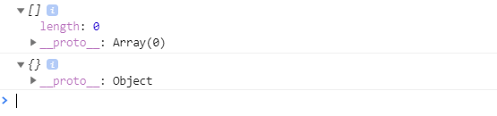
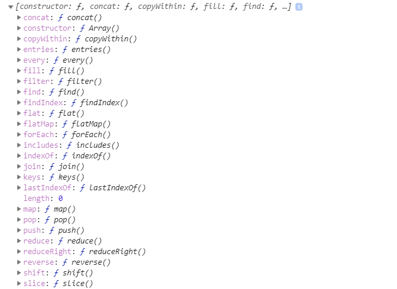
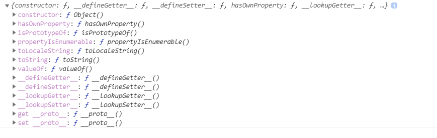

# 배열

### 배열과 객체

배열은 __객체__ 중 하나이다. 하지만 일반 객체와 약간의 차이점이 있다. 그것을 알아보자!!

- 배열의 type은 다음과 같이 객체이다!

  ```javascript
  let myArray = [ 'one', 'two', 'three'];
  console.log( typeof myArray ); //object
  ```

```javascript
let myArr = [];
let myObj = {};

console.log(myArr);
console.log(myObj);

console.log(myArr.__proto__);
console.log(myObj.__proto__);

```



myArr 프로토타입은 __Array__이다!






Array는 push, length 와 같은 다양한 프로퍼티를 가지고 있다. 따라서 이를 상속받은 myArr는 이 프로퍼티를 사용할 수 있게된다.


### 인덱스

```javascript
let myArr = [1,2,3];
console.log(myArr[0]); //1
console.log(myArr['0']); //1
```

위의 두 `console.log`는 문제없이 같은 수행을 한다. JS는 배열의 인덱스로 숫자가 올 때 자동으로 문자열로 바꾸는 기능을 하기 때문이다.


### 배열의 요소 삭제 

```javascript
let myArr = [1,2,3];
delete myArr[1];
console.log(myArr, myArr.length);
/* [1, empty, 3]
    0: 1
    2: 3
    length: 3 */
```

delete 연산을 통해 배열의 요소를 삭제하면 해당 원소에 `undefined`를 할당한다. 하지만 length값은 변하지 않는다. 해당 원소 자체를 삭제하고 싶다면 splice() 메서드를 사용해야한다.

```javascript
let myArr = [1,2,3];
myARr.splice(2,1); // 2번째 요소를 시작점으로부터 1개의 원소를 삭제.
```


### Array() 생성자 함수

`[]`로 생성하는 배열도 결국 JS의 기본 Array() 생성자 함수로 배열을 생성하는 과정을 단순화 시킨 것이다.

```javascript
let myArr = new Array(3);
console.log(myARr); // [undefined, undefined, undefined]

let myArr2 = new Array(1,2,3);
```

