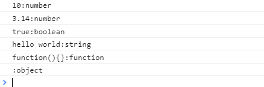
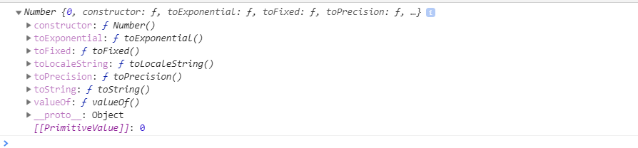

# 변수

### Data Type

한정된 메모리 공간을 효율적으로 사용하기 위해. 

### JS의 7가지 타입 

크게 `원시타입`과 `객체타입` 두 개로 나눌수 있다.

- 원시타입 : 변경 불가능한 값. 교체 할 수는 있지만 변경은 불가능하다 ==> immutable
  
  - Boolean
  
  - null
    
    - 명시적으로 값을 비웠음을 의미
    
  - undefined
    
    변수에 값이 없다는 것을 명시하고 싶다면 undefined가 아닌 null을 사용해야한다.
  
  ```javascript
  var myVal1
  var myVal2 = null
    
  console.log(myVal1 == myVal2) // true
    console.log(myVal1 === myVal2) // false
  ```
  
  -  Number
    
    -  모든 수는 실수로 처리된다.
    
    -  모든 수는 10진수로 해석된다.
    
    ```javascript
    let binary = 0b01000001; //2진수
    let octal = 0o101; //8진수
    console.log(binary == octal) //true
    ```
    
  - String
  
    문자열의 변경을 불가하지만 재할당은 가능하다. --> 원시타입
  
    ```javascript
    let str='string';
    str[0]='S'
    console.log(str); // stirng
    
    str='hello';
    console.log(str) // hello
    ```
  
  - Symbol (ES6에서 추가)
  
- 객체타입

  원시타입을 제외한 나머지 값들(배열, 함수 등)은 모두 객체이다.

  - Object
  
  원시 타입과 달리 확장이 가능해진다.
  
  이러한 객체타입을 표현하는 방식은 `json`이다.


```javascript
var n = 10
var f = 3.14
var b = true
var s = 'hello world'
var fn = function(){}
var a = []

console.log(n+":"+typeof(n))
console.log(f+":"+typeof(f))
console.log(b+":"+typeof(b))
console.log(s+":"+typeof(s))
console.log(fn+":"+typeof(fn))
console.log(a+":"+typeof(a))
```




##### Symbol

```:alarm_clock:
let mySymbol = Symbol();
```

---

### 표준 메서드

숫자, 문자열, boolean 타입에 대해 표준 메서드를 정의하고 있다.

##### 객체가 아닌데 어떻게 메서드를 호출할 수 있을까?

객체가 아닌 타입의 값들에 대해서 객체 형태로 메서드를 호출할 경우, 메서드 처리 순간에 **객체**로 **변환**된다!! 메서드를 호출하고 수행이 끝나면 다시 원래의 기본 값으로 복귀한다.

```javascript
let a= 3;
console.log(a.__proto__)
```



---

### Scope

##### 함수 레벨 스코프

함수 내에서 선언된 변수는 함수 내에서만 유효한다. 함수 외부에서는 참조할 수 없다.

단 `var`, `let`을 명시했을 때 해당한다.

##### 블록 레벨 스코프

코드 블록 내에서 선언된 변수는 그 블록 내에서만 유효하다. es6전의 js는 블록레벨 스코프를 적용하지 않아서 블록 외에서도 블록 내에서 생성한 변수를 사용할수 있었다.

https://poiemaweb.com/js-data-type-variable
