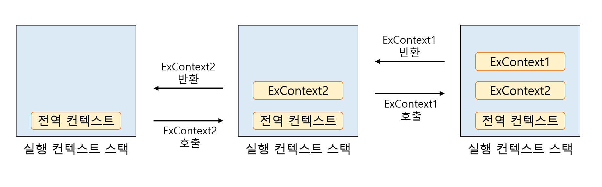
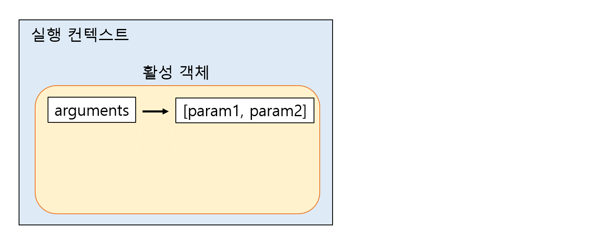
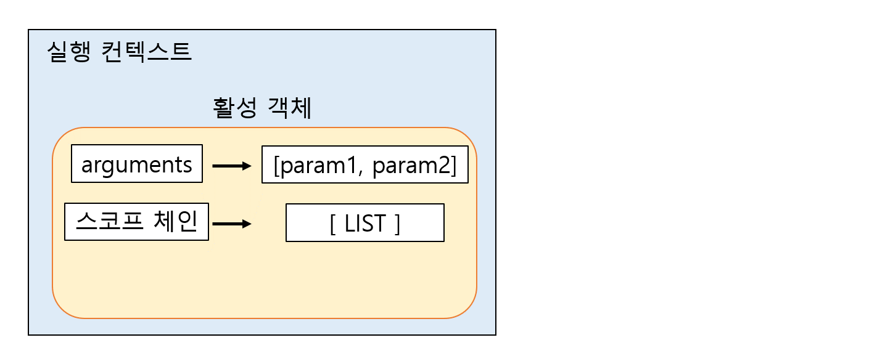
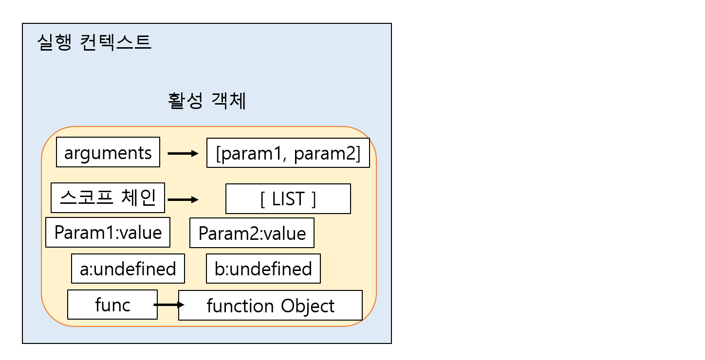
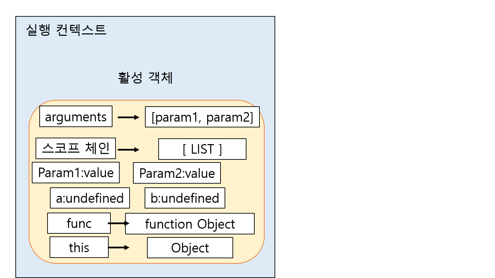

# 실행 컨텍스트

:arrow_forward:실행 가능한 JS 코드 블록이 실행되는 환경

`실행 가능한 코드 블록`이란 대부분의 경우 함수가 된다.


ECMA에서는 실행 컨텍스트가 형성되는 경우를 세가지로 규정한다.

1. 전역 코드
2. eval()함수로 실행되는 코드
3. 함수 안의 코드를 실행할 경우


대부분의 개발자는 함수로 실행 컨텍스트를 만든다. 그리고 이 코드 블록 안에 변수 및 객체, 실행 가능한 코드가 들어있다. 이 코드가 실행되면 실행 컨텐스트가 생기고, 실행 컨텐스트는 스택안에 하니씩 쌓인다. 제일 **위에** 위치하는 실행 컨텍스트가 현재 **실행**되고 있는 컨텍스트다. 현재 실행되는 컨텍스트에서 이 컨텍스트와 **관련 없는** 실행 코드가 실행되면, 새로운 컨텍스트가 생성되어 **스택에 들어가고 제어권이 그 컨텍스트로 이동**한다.

```javascript
console.log('this is global context');

function ExContext1(){
    console.log('this is context1');
};

function ExContext2(){
    ExContext1();
    console.log('this is context2');
};

ExContext2();  /*
				this is global context
				this is context1
				this is context2
				*/
```



## 실행 컨텍스트 생성 과정

```javascript
function execute(param1, param2){
    let a = 1, b = 2;
    function func(){
        return a + b;
    };
    return param1 + param2 + func();
}

execute(3,4);
```

이 코드로 실행 컨텍스트 생성과정을 설명하겠다.

### 1. 활성 객체 생성

실행 컨텍스트가 생성되면 JS 엔진은 해당 컨텍스트에서 실행에 필요한 여러가지 정보를 담을 객체를 생성하는데, 이를 활성 객체라고 한다. 이 객체에 앞으로 매개변수나 사용자가 정의한 변수 및 객체를 저장하고 새로 만들어진 컨텍스트로 접근 가능하게 되어 있다. 이는 엔진 내부에서 접근할 수 있다는 것이지 사용자가 접근할 수 있다는 것은 아니다.


### 2. arguments 객체 생성

다음 단계에서는 arguments 객체를 생성한다. 앞선 만들어진 활성 객체는 arguments 프로퍼티로 이 arguments 객체를참조 한다.



### 3. 스코프 정보 생성

현재 컨텍스트의 **유효 범위**를 나타내는 스코프 정보를 생성한다. 현재 실행 중인 실행 컨텍스트 안에서 **연결 리스트와 유사한 형식**으로 만들어 진다. 이 리스트에서 찾지 못한 변수는 결국 정의되지 않는 변수에 접근하는 것으로 판단하여 에러를 검출한다.

생성된 활성 객체가 스코프 체인의 제일 앞에 추가되며, execute() 함수의 인자나 지역 변수 등에 접근할 수 있다.



### 4. 변수 생성

`execute()` 함수 안에 정의된 변수 a,b와 함수 func가 생성된다. 단 이 과정에서는 변수나 내부 함수를 단지 메모리에 생성하고 초기화는 각 변수나 함수에 해당하는 표현식이 **실행되기 전까지는** 이루어지지 않는다.



### 5. this 바인딩

this 키워드를 사용하는 값이 할당된다.



### 6. 코드 실행

코드에 있는 여러가지 표현식이 실행된다. 변수의 초기화 및 연산, 또 다른 함수 실행 등이 이루어 진다.


### 전역 실행 컨텍스트

일반적인 실행 컨텍스트와 달리 `arguments` 객체가 없으며 전역 객체 하나만을 포함하는 스코프 체인이 있다.


## 클로저:four_leaf_clover:

이미 생명 주기가 끝난 외부 함수의 변수를 참조하는 함수.

이것이 가능한 이유는 외부 함수가 실행 컨텍스트에서 사라지더라도 활성 객체에 해당 변수들이 저장되어 있기 때문이다.

```javascript
function outerFunc(arg1, arg2){
    let local = 8;
    function innerFunc(innerArg){
        console.log((arg1+arg2)/(innerArg+local));
    }
    
    return innerFunc;
};

let exam1 = outerFunc(2,4);
exam1(2);
```

outerFunc() 함수를 호출하고 반환되는 함수 객체인 innerFunc()가 exam1으로 참조 된다.이것은 exam1(n)의 형태로 실행될 수 있다.

outerFunc()가 실행되면서 생성되는 변수 객체가 스코프 체인에 들어가게 되고, 이 스코프 체인은 innerFunc의 스코프 체인으로 참조된다. **즉 outerFunc() 함수가 종료되었지만, 여전히 내부 함수의 스코프로 참조되므로 접근할 수 있다.**

 

:pen:인사이드 자바스크립트 참고 :book: