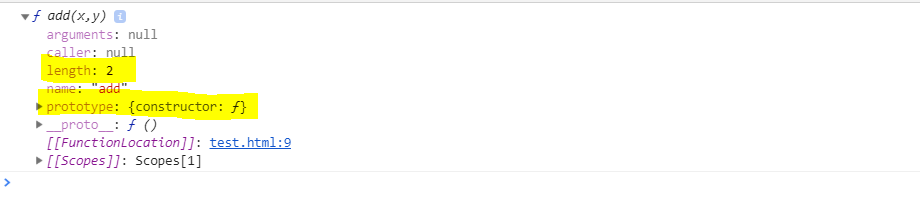
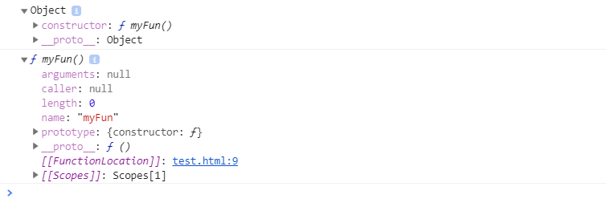

# 함수

:arrow_forward:JS에서 함수 역시 **객체**이다!

```javascript
function add(x,y){
    return x+y;
}

console.dir(add);
```

위를 실행하면 add 함수에 담긴 다양한 프로퍼티를 확인할 수 있다.



ECMA5에 의하면 모든 함수는 `length`와 `prototype` 프로퍼티를 가져야 한다. 위를 통해 확인할 수 있다. `length`는 함수의 인자 개수를 말한다.

### `prototype` 프로퍼티

모든 함수는 객체로서 `prototype` 프로퍼티를 가지고 있다. 여기서 주의할 것은 함수 객체의 `prototype` 프로퍼티는 모든 객체의 부모를 나타내는 **내부 프로퍼티인 prototype**과 혼동하지 말아야 한다.

`prototype` 프로퍼티는 함수가 생성될 때 만들어지며, constructor 프로퍼티 하나만 있는 객체를 가리킨다. constructor 프로퍼티는 자신과 연결된 함수를 가리킨다. 즉 함수를 생성할 때, 함수 자신과 연결된 프로토타입 객체를 동시에 생성하며 이 둘은 서로를 참조한다.

:arrow_forward:이것을 **체이닝**이라 한다! 어렵다!!

```javascript
function myFun(){
    return true;
}

console.dir(myFun.prototype);
console.dir(myFun.prototype.constructor);
```




### 콜백 함수

코드를 명시적으로 호출하는 함수가 아닌, 개발자는 함수를 등록해놓고 **어떤 이벤트가 발생했거나 특정 시점에 도달했을때 시스템에서 호출되는 함수**를 말한다.

또한 특정 함수의 인자로 넘겨서 코드 내부에서 호출되는 함수 또한 콜백함수가 될 수 있다.

- 이벤트 핸들러 처리

  대표적인 콜백함수의 예.

  원하는 이벤트 핸들러에 콜백함수가 등록됐다면, 이벤트가 발생할때마다 브라우저에 의해 실행된다.

### 내부 함수

:arrow_forward:함수 내부에 정의된 함수 

```javascript
function parent() {
    let a = 100;
    let b = 200;
    
    function child() {
        let b =300;
        console.log(a,b);
    }
    
    child();
};

parent(); //100 300
```

- 내부함수에서는 부모함수의 변수에 접근이 가능하다.
- 내부함수는 일반적으로 자신이 정의된 부모함수 내부에서만 호출이 가능하다.


### arguments 객체

:arrow_forward:런타임 시에 함수에서 호출된 인자의 개수를 확인해주는 객체.

```javascript
function add(a,b){
    console.log(arguments);
    return a+b;
}
```

- 인자의 값을 더하는 함수.

  ```javascript
  function sum(){
      let result = 0;
      for ( let i=0 ; i< arguments.length ; ++i ){
          result += arguments[i];
      }
      return result;
  }
  
  console.log(sum(1,2,3));
  ```


### this

함수를 호출하면, 해당 함수 내부 코드에서 사용된 this는 전역객체에 바인딩된다. 브라우저에서 실행하는 경우 이 전역 객체는 window객체가 된다.

- nodeJS의 경우 global 객체가 된다.

```javascript
let test = 'This is test'; // This is test
console.log(window.test);

let sayTest = function(){
    console.log(this.test);
}

sayTest(); // This is test
```


##### 내부함수에서의this

```javascript
let myObj = {
	value :1,
	func1 : function (){
		this.value += 1;
		console.log('func1() -- ',this.value);

		func2 = function(){
			this.value += 1;
			console.log('func2() -- ', this.value);
		
			func3 = function(){
				this.value += 1;
				console.log('func3() -- ',this.value);
			}

			func3();
		}

		func2();
	}
}

myObj.func1();
```

여기서 func2와 func3에서의 **this**은 myObj을 가리키지 않는다.

메서드(객체 안의 함수)인 `func1`의 경우 **this**를 통해 `myObj`에 접근할 수 있지만 내부 함수인 `func2`와 `func3`의 경우 **this**는 `window`를 말한다.(브라우저에서)

다음의 과정을 통해 원하는 수행을 할 수 있다.

```javascript
let myObj = {
	value :1,
	func1 : function (){
		let that = this;
		this.value += 1;
		console.log('func1() -- ',this.value);

		func2 = function(){
			that.value += 1;
			console.log('func2() -- ', that.value);
		
			func3 = function(){
				that.value += 1;
				console.log('func3() -- ',that.value);
			}

			func3();
		}

		func2();
	}
}

myObj.func1();
```


- 이 같은 한계를 극복하고자 **this 바인딩**이 등장한다.

