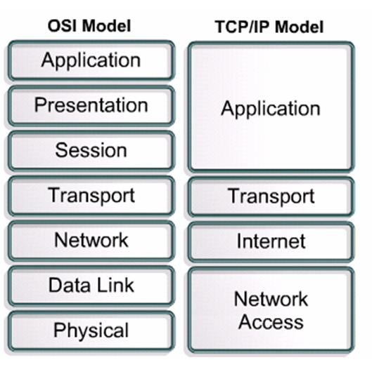

# 계층과 프로토콜

- TCP/IP 프로토콜 계층

  - Link 계층 (Network Access)

    1. Host간의 네트워크를 통한 데이터 통신을 위한 물리적 연결에 대한 표준
    2. LAN, WAN 등과 같은 네트워크 구성을 정의
    3. 상위 계층인 Internet 계층에서 형성된 패킷을 전기 신호 또는 광신호로 바꾸어 전달함.

  - Internet 계층

    1. 데이터의 정의 및 경로 지정.
    2. 정확한 라우팅을 위해 **IP프로토콜**을 사용

    - IP프로토콜은 IP주소를 부여하는 방법과 체계를 정의한다.

  - 전송 계층

    1. 하위 Internet 계층의 IP가 해결한 목적지 까지의 네트워크 상의 경로에서 실제 데이터를 전송.
    2. TCP, UCP와 같은 프로토콜을 결정
    3. IP는 하나의 패킷이 전달되는 과정에만 중심을 두고 설계 되었기 때문에 여러 패킷으로 나눠져 전달되는 데이터의 순서와 전송 자체는 신뢰할 수 없다.
    4. 데이터의 **순서**와 **신뢰할 수 있는 데이터 전송**을 보장하는 역할.

  - 응용 계층

    1. 응용 프로그램들이 데이터 통신을 하게 된다.

