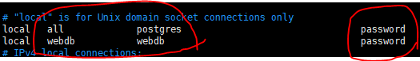
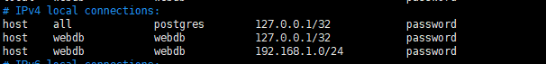

# PostgreSQL

- 객체관계형DB (ORDBMS)
- sql 표준 대부분을 지원한다.
- 대소문자 구분이 없다.


### 비밀번호 설정

`=# alter user [user] with password [비밀번호];`

postgreSQL/data/pg_hba.conf 파일

USER 칸에 user 계정 적고 METHOD에 password[진짜 비밀번호가 아니고 비밀번호를 사용하겠다는 말]를 넣는다.

특정 db에만 허용하고 싶은 경우 아래처럼 한다.


### 접속 권한 및 외부 접속



세번째 줄의 경우 192.168.1.* 으로 들어오는 모든 접속을 허용해 주는 말이다. [webdb로 접근시]


### 종료

`# \q`


### 리눅스로 잠시 가기

`# \!`

`$ exit`로 빠져나온다.

`# \! [명령어]`

하면 바로 명령어만 실행하고 돌아온다.


### 테이블 권한 바꾸기

`# alter table [table] owner to [user]`

---

---

### create database

`# create database [db이름]`

`# \ㅣ` 로 확인

### use database

`# \c [db이름]`  

### show table

`# \dt`

접속할때 `$ psql -U [user] [database]`로 접속해도 된다.

### desc table

`# \d [table]`

### drop table

`# drop table [table]`

### 컬럼 타입 변경

`# alter table [table]  alter column [column] type [새 타입]`

### 권한 주기

`# grant all privileges on all tables in schema public to [user];`


## sequence

sql에서 `auto_increment` 같은 역할을 `sequence`를 통해 구현할 수 있다.

- sequencs 설정

```sql
create sequence seq_author start 1; 
```

- seq 사용해서 insert

```sql
insert into author values( nextval('seq_author'), '맹자');
```

