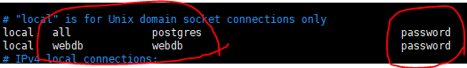
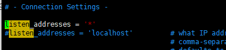

# PostgreSQL

- 객체관계형DB (ORDBMS)
- sql 표준 대부분을 지원한다.
- 대소문자 구분이 없다.


### 실행 (centos7)

`# systemctl start postgresql-9.6.service`


### 쉘로 접속 (centos7)

`sudo -i -u postgres psql`

### user 생성

`=# create user [user] with password '[password]';`

### 비밀번호 설정

`=# alter user [user] with password '[비밀번호]';`

postgreSQL/data/pg_hba.conf 파일

USER 칸에 user 계정 적고 METHOD에 password[진짜 비밀번호가 아니고 비밀번호를 사용하겠다는 말]를 넣는다.

특정 db에만 허용하고 싶은 경우 아래처럼 한다.


## User 계정으로 접속 (centos7)

`# psql -U [계정] -d [db]`


### 접속 권한 및 외부 접속


세번째 줄의 경우 192.168.1.* 으로 들어오는 모든 접속을 허용해 주는 말이다. [webdb로 접근시]


### pg_hba.conf 파일을 못 찾겠을때

1. 상위 권한으로 접속 : `sudo su - postgres`
2. 여기서 찾으면 된다. 여기는 postgresql이 설치된 home경로 이다(?)


### 그래도 connection refused 가 뜬다면



`data/postgresql.conf` 파일에 주석처리돼 있는, `listen_addresses`를 '*'로 모두 열어준다. 


### 종료

`# \q`


### 리눅스로 잠시 가기

`# \!`

`$ exit`로 빠져나온다.

`# \! [명령어]`

하면 바로 명령어만 실행하고 돌아온다.


### 테이블 권한 바꾸기

`# alter table [table] owner to [user]`

---

---

### create database

`# create database [db이름]`

`# \ㅣ` 로 확인

### use database

`# \c [db이름]`  

### show table

`# \dt`

접속할때 `$ psql -U [user] [database]`로 접속해도 된다.

### desc table

`# \d [table]`

### drop table

`# drop table [table]`

### 테이블 명 변경

`# alter table [table] rename to [바꿀 이름]`

### 컬럼명 변경

`# alter table [table] rename column [기존 이름] to [바꿀 이름]` 

### 컬럼 타입 변경

`# alter table [table]  alter column [column] type [새 타입]`

:pushpin:serial와 같은 특수한 타입은 이 명령어로 바꿀 수 없다. 타입을 바꿀 수 있는 특수한 함수를 사용해야 한다.

`# alter table [table]  alter column [column] type [새 타입] using [column]::[새 타입]`


데이터가 들어간 경우 안전하게 하기 위해 위의 속성을 추가한다.

### 컬럼 셋팅 추가

`# alter table [table] alter column [column] set [setting 정보]`

예시)

`# alter table member1 alter column no set not null;`

### 컬럼 셋팅 제거

`# alter table [table] alter column [column] drop [setting 정보]`

### 컬럼 추가

`# alter table [table] add [column] [type]`

### 컬럼 삭제

`# alter table [table] drop column [column]`

### 권한 주기

`# grant all privileges on all tables in schema public to [user];`

### cascade

참조 키를 무시하고 테이블을 삭제할 때 사용.

`# drop table [table] cascade`

## sequence

sql에서 `auto_increment` 같은 역할을 `sequence`를 통해 구현할 수 있다. `pk`로 설정한 컬럼의 경우에는 자동으로 `sequence`가 설정돼 있다.

- sequencs 설정

```sql
create sequence seq_author start 1; 
```

- seq 사용해서 insert

```sql
insert into author values( nextval('seq_author'), '맹자');
```


```sql
create table t1(
	c1 serial
);

insert into t1 values(default);

select * from t1;
-------------------------------------------------------
create sequence t2_seq;
create table t2(
	c2 int not null default nextval('t2_seq')
);
alter sequence t2_sql owned by t2.c2
insert into t2 values(default);
select * from t2;
```


### enum

```sql
create type mood as enum('sad','ok','happy');
create table person(
	name varchar(10),
	current_mood mood
);
insert into person values('hans','happy');
select * from person;
select * from person where current_mood>'ok';  -- sad < ok < happy
```

### json

```sql
select '{"result":"success", "data":1}'::json;

create table t5(
	response json
);

insert into t5 values('{"result":"success", "data":1}');
```

여기서 key를 가지고 select 하거나 insert하는 방법이 있을 것이다!!

안찾아봄.


### dump 파일 업로드

`# [postgresql 이름] -U [db] -f [file name] [password?]`

나는 `# psql -u hr -f employee.dump hr` 으로 했다.


### mysql과 다른 쿼리들

- sql에 auto_increment 컬럼인 값으로 `null`을 주는 것처럼 postgresql에서는 `default`를 준다.

- date type인 컬럼은 `to_char` 함수를 사용해서 변환해 줘야한다.

    ```sql
    select * from salaries where to_char(from_date, 'yyyy-mm-dd') like '2001%';
    ```

- alias `'`는 안됨. `"`를 쓰자. 근데 문자열에는 `'`를 쓴다.

- enum type에서 대소문자를 구분한다.

- trim

    ```sql
    select trim(both 'x' from 'xxxdddvvxx'); -- dddvv
    ```

- select current_date;

- select current_timestamp;

- pgsleep(n)

    ```sql
    select clock_timestamp(), pg_sleep(2), clock_timestamp();
    ```

- 날짜 형식

    ```sql
    select to_date('2010-10-01 01:10', 'yyyy-mm-dd'); -- 단지 문자열을 date로 바꿔준다.
    												-- 이때 날짜나 시간의 범위는 맞아야 한다.
    												
    select to_date('2010-10-01 01:10', 'yyyy'); -- 이렇게 하면 2010-01-01로 나온다.
    ```

- date_part

    ```sql
    select date_part('year',current_date); -- 2019
    select (date_part('year', now()) - date_part('year', hire_date) ) as "year" , hire_date from employees limit 1; 
    select (date_part('month', now()) - date_part('month', hire_date) ) as "month", hire_date  from employees limit 1; 
    
    select '20190101'::date; -- 2019-01-01
    ```

- 연산

    ```sql
    -- year, month, day, hour, minute, second, millisecond
    select now() + interval'12 hour';
    select now() - interval'12 hour';
    
    select '1'::integer+1;
    ```


```sql
select emp_no, avg(salary) 
	from salaries 
	where to_char(from_date,'yyyy') ='1985'
	group by emp_no
	having avg(salary) > 1000;
```


## 윈도우에서 사용하기

### 실행파일

` C:\Program Files\PostgreSQL\10\scripts\runbsql.bat` 실행

