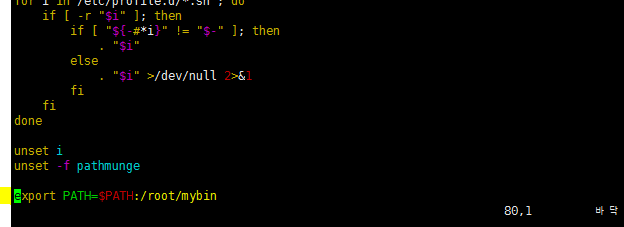

# a.out 가 실행 안되는 이유

`a.out`가 아닌 `./a.out`를 해야 실행 파일이 실행 될까 :question:

그 이유는 리눅스의 경우 현재 dir을 파악하지 못하기 때문에 `a.out`파일을 찾지 못하기 때문이다. 그래서 현재 경로를 알려주는 `./`를 포함해야 한다.

:heavy_plus_sign: 리눅스가 파악하는 path

다음의 path는 리눅스가 파악하고 있다. 그래서 이 dir 에 실행파일을 생성하면 실행된다. 혹은 이 `path`에 원하는 경로를 추가하면 그 폴더에 있는 실행파일을 실행 할 수 있게 된다.

### `path`에 경로 추가하기

1. `/etc/profile`파일에 path를 추가한다.

   `export PATJ=$PATH:원하는 경로`

   

2. `source`명령어로 적용시킨다.

   `$ source /etc/profile`

3. echo $PATH로 확인해 보자@@@

