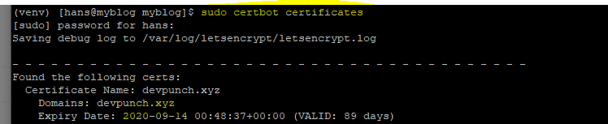

# ssh 인증서 갱신


## install

```
$ wget https://dl.eff.org/certbot-auto$ chmod a+x certbot-auto
```


## 갱신 테스트

```
$ sudo certbot renew --dry-run
```

`--dry-run`옵션으로 갱신이 잘 되는지 테스트 할 수 있다.


## 갱신

```
$ sudo certbot renew
$ sudo certbot certificates  # 만료일 확인하기
```


