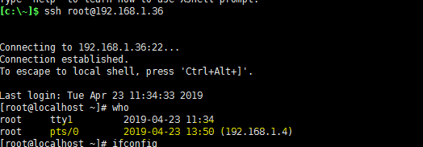
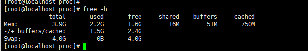

# 명령어

### pwd

print working dir

### cd

change dir

### ssh

ssh 리모트 접속

`$ ssh 계정@서버 ip`

원격 접속했다는 사실을 알 수 있다. <-- **pts**

### source

스크립트 파일을 수정한 후에 수정된 값을 바로 적용하기 위해 사용하는 명령어.

예를 들어 /etc/bashrc 파일을 수정 후 저장하여도 수정한 내용이 바로 적용되지 않는다. 이 파일은 유저가 로그인할때 읽어들이는 파일이여서, 로그아웃후 로그인 하거나 리눅스를 재시작해야 다시 적용이 된다.

이럴경우 간단하게 `$ source /etc/bashrc`명령어로 수정된 내용을 바로 적용할 수 있다.

[https://klero.tistory.com/entry/source-%EB%AA%85%EB%A0%B9%EC%96%B4%EB%9E%80](https://klero.tistory.com/entry/source-명령어란)

## tar

#### 압축 하기

`$ tar -cvzf [압축할 파일 이름] [압축할 파일이나 폴더명]`

`$ gzip [압축할 파일 이름]`

`tar`은 압축이 아닌 파일을 묶는 행위를 한다.

#### 압축 풀기

`$ tar -xvzf [압축 해제할 파일]`

### MV

파일 이동 명령어. 이동 시 원본 파일이 삭제 된다. `cp` 명령어와 비슷하게 사용할 수 있다.

### 계정 추가

`$ useradd 계정 이름`

`$ useradd -g 그룹 -d /home/폴더 이름 계정 이름`

`$ ls /home` 을 통해 확인해 보자.

#### passwd 설정

`$ passwd 계정이름`

## mount

**"장치를 마운트 한다" **

장치를 특정 파일/폴더에 할당한다는 뜻. 예를 들어 CD-ROM을 마운트 한다는 것은 특정 폴더에 들어가면 해당 CD-ROM의 내용을 볼 수 있도록 한다는 것.

<https://raisonde.tistory.com/entry/리눅스-mount-명령어-정복>

## ls

`$ ls 옵션  dir`

#### 옵션

- l : 파일에 대해서 권한이나 생성 시간처럼 보다 자세한 내용을 출력한다.
- a : 숨긴 파일이나 디렉터리 등의 현재 디렉터리의 모든 내용을 출력한다.
- h : 파일 크기를 k,m,g와 같이 사람이 읽기 편한 단위로 출력한다.
- F : 실행 파일이나 디렉터리 등이 쉽게 구분 될 수 있도록 출력한다.
- R : 하위 디렉터리의 내용들도 함께 출력한다.

## ll

#### 큰것 부터 보기

`ll -SS`

#### 작은 것부터 보기

`ll -SSr | grep ^-`

### mkdir

> $ mkdir dir1
>
> $ mkdir dir1/dir2

> $ mkdir -p dir1/dir2

같은 결과 !

### rmdir

> $ rmdir dir1/dir2/dir3

--> dir3 을 삭제.

> $ rmdir dir1

--> dir1이 비워있지 않으면 불가하다.

### cp

#### dir 복사

`$ cp -R dir dir2`

### ln

`$ ln -s [실제 폴더명] [링크 걸 폴더명]`

### 파이프

프로그램의 실행 결과를 다른 프로그램의 입려으로 연결한다. 둘 이상의 명령을 함께 사용하고, 한 명령어의 출력괄과를 다른 명령어의 입력으로 전환하는 것.

### chmod

파일의 권한을 변경할 때 사용.

#### :pushpin: 명령어 8진수

0 : 000
1 : 001
2 : 010
3 : 011
4 : 100
5 : 101
6 : 110
7 : 111

위의 2진수 세자리는 **rwx**(read, write, 실행) 세자리와 일치하며 2진수가 1이면 해당권한을 부여한다.

#### :pushpin:대상

u:user

g:group

o:other

`$ chmod 770 test.cnf`

:arrow_forward: test.cnf 파일에 대해 user, group은 모두 rwx를 할 수 있도록 변경하고 other은 모든 권한을 제거한다.

<http://www.redcrow.co.kr/wordpress/?p=532>

### chown

파일 소유자나 소유 그룹을 변경하기 위한 명령어

`$ chown [옵션] 소유자:소유그룹 파일명`

### chkconfig

서비스로 등록

`$ chkconfig --add [서비스 -> 파일]`

해제

`$ chkconfig --del [서비스]`

서비스 활성화

`chkconfig [--level levels] [서비스] <on|off|reset>`

그전에 해당 파일의 실행 권한을 허락해 줘야 한다.

`$ chmod 755 [서비스]`

### tail

`$ tail -f log 파일`

젠킨스의 경우 catalina.out 파일에 실시간으로 저장된다.

### kill

프로세스를 죽이는 명령어가 아닌 프로세스에게 시그널을 보내는 명령어.

옵션중 가장 유명한 옵션이 프로세스를 죽이는 옵션(-9)이라서 kill이다.

---

#### /proc

실행중인 프로세스 정보와 CPU, 메모리 등의 시스템 정보가 가상 파일로 저장되어 있다. 대부분 읽기 전용이나 일부 파일 중에는 쓰기가 가능한 파일들이 있는데 이런 파일들은 커널의 기능을 변경할 수 있다.

cat 명령어를 통해 해당 파일의 정보를 확인할 수 있다.

`$ cat /proc/[something]`

### free

리눅스 시스템의 메모리 사용량을 확인할 수 있는 명령어.

### `$free -k`

현재 추가로 사용할 수 있는 메모리는 2.4GB(1.6*1024 + 51 + 750)이다.

- buffers 영역

  disk에 기록하기 전 저장해두는 메모리 영역. 실체는 아직 없음

- cached 영역

  캐시 영역. 실체는 어딘가에 있고 빠른 접근을 위해 따로 저장해두는 메모리 영역\

- swap 영역

  물리메모리를 모두 사용했을 경우 사용하는 디스크의 영역.

### find

특정 디렉터리에 있는 파일이나 폴더를 찾는다. ( 하위 디렉터리, 숨겨진 파일도 포함 )

`$ find /etc -name "*.txt"`

/etc 하위에 있는 폴더중 txt 파일을 찾는다.

`$ find /etc -name "*.txt" -type d`

폴더만 찾고 싶을 때.

## install

- 설치 가능한 패키지 검색

  `$yum list 찾고싶은패키지*`

  `$yum list postgres*`

## os 버전확인

`$  cat /etc/redhat-release`

## systemctl

## less, more

`$ less 파일명`

파일을 읽는데 방향키로 위치 조절이 가능하다

`$ less +G 파일명`

- 아래에서 부터 읽기

## fuser

> port kill

`# fuser -k 포트/tcp`

> centos 에서는 설치부터 해야한다.

`$ yum install psmisc`

### 줄수 count

`$  ls | wc -l`

#### grep 와 함께 유용하게 사용할 수 있다.

`$ grep 원하는거 | wc -l `

### 파일 개수

`ls -l | grep ^- | wc -l`

## CAT

### line number

`cat -n`