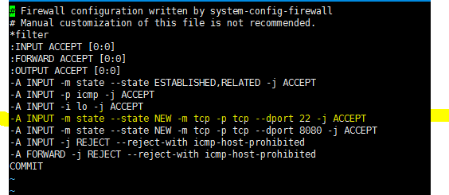

# 방화벽 허용 및 관리

`/etc/sysconfig/iptables` 파일을 수정한다.

22 포트의 경유 따로 설정을 해주지 않아도 외부에서 연결가능하다. 이것은 위처럼 22포트는 default로 accept됐기 때문!

열고싶은 포트또한 accept 처리해준다.

그리고 iptables을 재시작해준다.

> $ /etc/init.d/iptables stop
>
> $ /etc/init.d/iptables start

