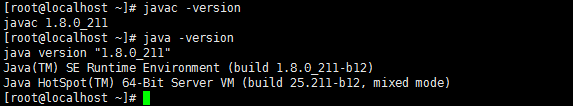

# 자바 실행

### JDK 다운

jdk를 다운받는다.

나의 경우는 jdk파일을 받아서 wget를 통해 압축을 풀었다.

이때 아무대나 풀면 안되고 위치를 기억해서 환경변수에서 설정해야 한다.


### 환경 변수 설정

`/etc/profile` 파일에서 자바 환경 변수를 추가한다.

`JAVA_HOME`, `PATH`, `CLASSPATH` 세개를 추가했다.

```shell
export JAVA_HOME=/jdk경로
# export JAVA_HOME=JAVA_HOME=/usr/local/cafe24/jdk1.8.0_211
export PATH=$PATH:$JAVA_HOME/bin
export CLASSPATH=.:$JAVA_HOME/lib/tools.jar

```




잘 설정됐는지 확인하자!


### 실행

1. test.java 파일 생성
2. javac test.java
3. java test


```java
public class HelloWorld {
    public static void main(String[] args) {
        System.out.println("Hello, world!");
    }
}
```


### java VS javac

- javac

  자바 컴파일러로써, 자바 코드를 작성한 소스파일 (.java)을 자바 가상머신이 인식할 수 있는 바이트 코드 (.class) 타입으로 변환시켜주는 명령어 이다.

<https://allinfo.tistory.com/15>
