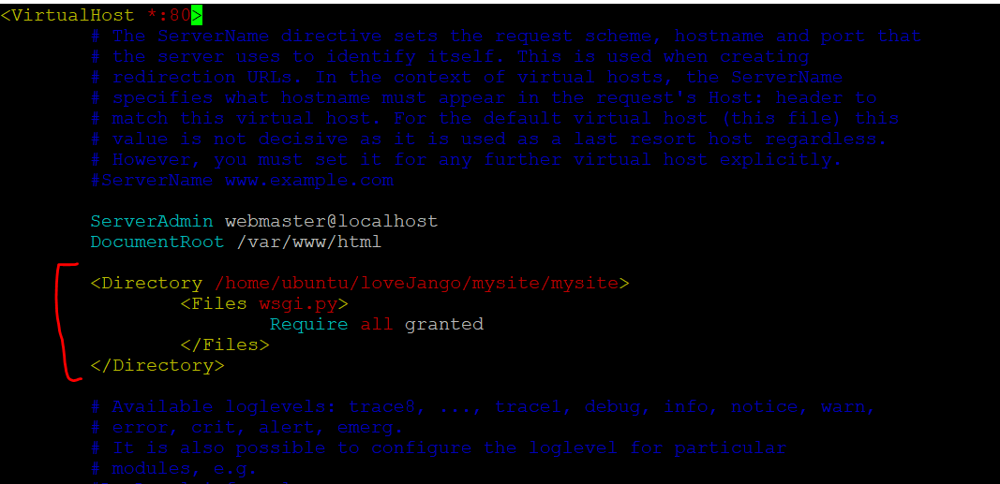

# apache

#### 설치

> sudo apt-get install apache2

#### 특정 port 열기

`ports.conf`파일에서 **Listen `port`**를 입력한다.

> cd /etc/apache2
>
> sudo vim ports.conf

### 아파치 설정 파일 수정

`vi /etc/apache2/site-available/000-default.conf` 파일을 수정한다. 실행한 프로그램의 위치를 입력해서 이 프로그램을 아파치를 통해 실행할 것이라는 것을 알려준다.

[예시]

## for Python

#### 아파치 mod-wsgi 설치

> sudo apt-get install libapache2-mod-wsgi-py3