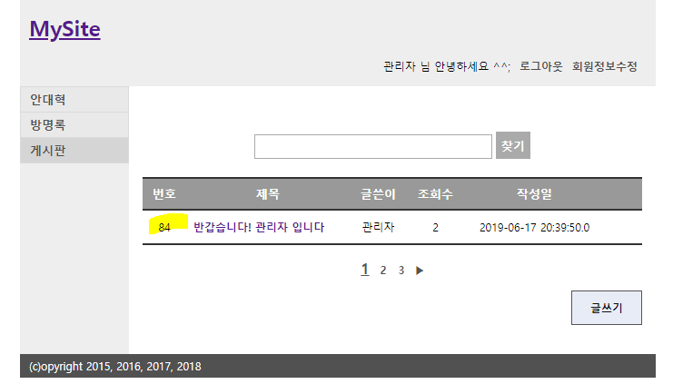
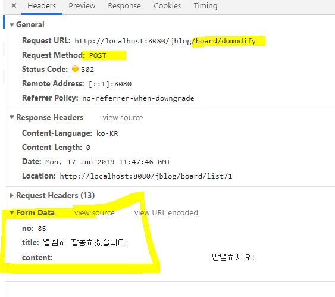
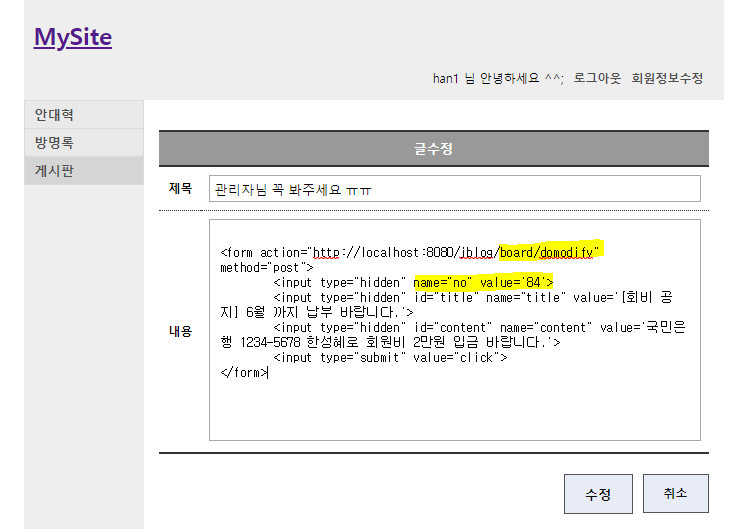
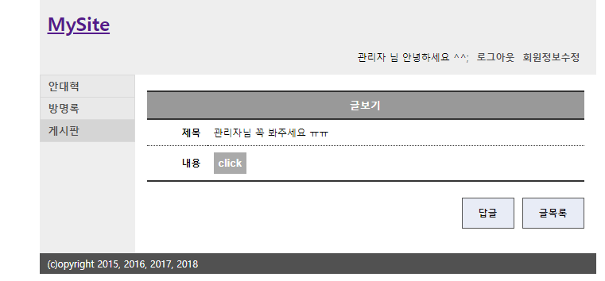
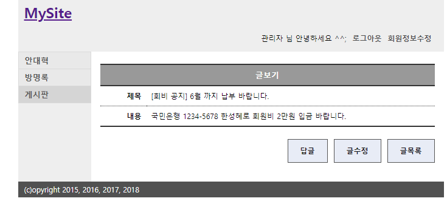
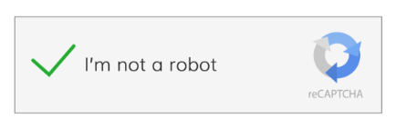

# :smiling_imp:CSRF 공격 :smiling_imp:

> Cross Site Request Forgery : 사이트 간 요청 위조

사용자가 현재 로그인해 있는 취약한 사이트로 악의적인 사이트에서 요청을 전송하는 공격.

희생자는 의도치 않게 웹서버(ex. 페이스북, 네이버 등 )에 악의적인 내용이 담긴 코드를 전송(요청)하게 되며, 웹 서버는 그 요청을 받아 들인다.

2008년 1080만 명의 개인정보가 유출된 옥션 해킹사건에 사용된 공격 기법이다.

## 예제 :memo:

이 사이트를 보던 해커는 게시판 페이지에서 번호가 게시글 테이블의 번호와 같다는 점을 발견했고 이것을 이용하여 CSRF 공격을 하기로 했다.

해커는 회원가입을 한뒤 직접 게시글을 작성하고 수정하면서 수정 request에는 다음과 같은 값들이 필요한것을 확인했다.

이러한 점을 확인한 뒤 관리자의 게시글을 수정하기로 마음먹었다.

이 공격의 타겟은 해당 게시글(84번 게시글)의 글쓴이인 관리자 이다.

csrf 공격은 이 사이트에 이미 피해자가 될 유저의 세션이 저장돼 있다는 점을 이용하여 해당 요청과 같은 요청을 할 수 있다.

공격을 하기 위한 조건은 

1. 관리자가 로그인한 상태여야 한다.

   그래야 세션에 관리자가 저장돼 있고 관리자의 글을 수정할 수 있다.

2. 관리자가 글을 수정하는 request를 실행하게 해야 한다.

   이것을 하기 위해 관리자가 알지 못하는 곳에 request form을 넣어야 한다.

   다음과 같이 구현할 수 있다.

   

   

수정을 완료한 뒤 관리자가 해당글을 보고 버튼을 클릭하면 post 요청이 가고 다음과 같이 글이 수정된다.

## 대응 방안 :+1:

### CSRF 토큰 사용

### 사용자와 상호 처리 기능 적용

CAPTCHA(사용자가 실제 사람인지 컴퓨터 프로그램 인지를 구별하는 기술)와 같은 사용자 상호 처리 가능한 기법을 적용한다. 뚫기 매우 쉬워 보이지만 정교한 CAPTCHA는 [바둑을 인공지능으로 풀어내는 것](https://namu.wiki/w/알파고) 이상으로 어렵다고 한다.

### 재인증 요구

재인증을 통해 안전하게 실제 요청 여부를 확인 하도록 설계한다.

예를 들어서 비밀번호 변경의 경우 변경할 비밀번호만 적는 것이 아니라 현재 비밀번호를 먼저 적는 절차를 넣는 것이다.