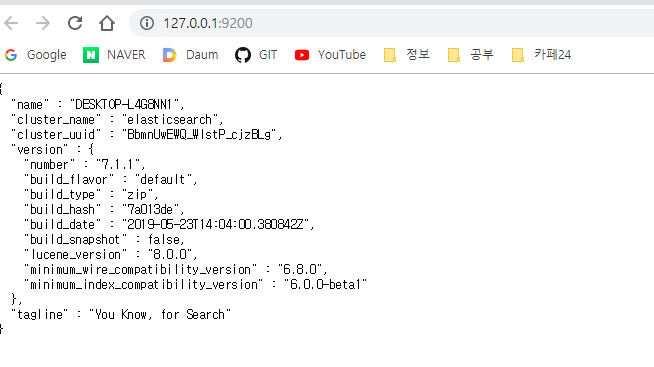
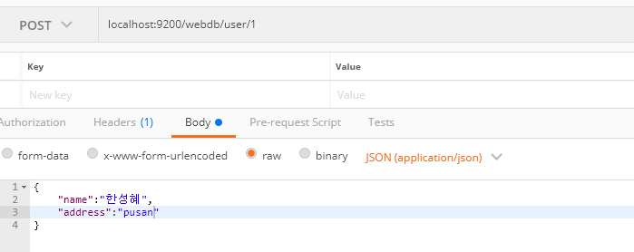
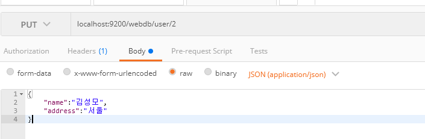

# ElasticSearch

REST기반의 실시간 검색 및 분석 엔진.


### 설치

홈페이지에 있는 zip 파일이나 install 명령어로 쉽게 설치 할 수 있다.

윈도우 기준으로 `bin/elasticsearch.bat` 파일을 실행시키면 시작하며 `localhost:9200`에 접속했을 때 다음과 같은 결과가 뜨면 잘 설치 된 것이다.



기본으로 9200, 9300 포트가 사용되며, 9200 포트는 HTTP로, 9300은 TCP로 바인딩 된다.


### 저장 구조

ES 저장 구조에는 RDB와 유사한 용어 들이 나온다. 

- Index
  - rdb의 `데이터베이스`와 유사
- Type
  - rdb의 `테이블`과 유사
- Document
  - 테이블의 `row`와 유사
- Field
  - 테이블의 컬럼과 유사
- Mapping
  - rdb의 스키미와 유사


## 사용하기


### URL 포맷

ES를 사용하기 위한 Rest API URL 포맷은 다음과 같다.

` http:// [Node] : [Port] / [index] / [type]`

- index는 소문자여야 한다.


### 저장하기 [insert]



`webdb` index의 `user` type에 `1`이라는 `id`로 다음과 같은 데이터를 저장한다는 뜻이다.

이에 따른 응답값은 다음과 같다.

```json
{
    "_index": "webdb",
    "_type": "user",
    "_id": "1",
    "_version": 1,
    "result": "created",
    "_shards": {
        "total": 2,
        "successful": 1,
        "failed": 0
    },
    "_seq_no": 0,
    "_primary_term": 1
}
```


### 조회하기 [select]

`localhost:9200/webdb/user/_search` <-- 전체 검색

`localhost:9200/webdb/user/1`  <-- id값으로 조회


### 수정하기 [update]




### index 조회 [desc]

`localhost:9200/webdb