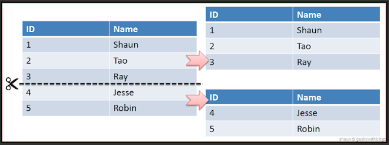
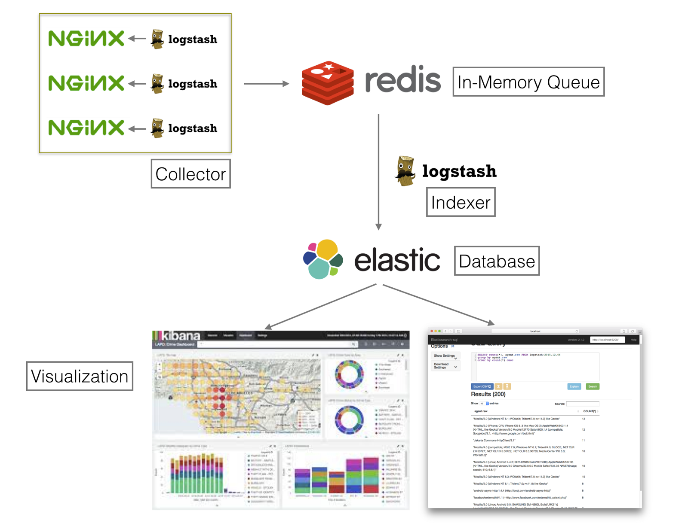

# ElasticSearch

>  Java로 만들어진 분산 검색 엔진.
>
> 방대한 양의 데이터를 신속하게, 거의 실시간으로 저장, 검색 할 수 있다.


## :pushpin: ElasticSearch 구조


### 1. 클러스터

   - ElasticSearch에서 가장 큰 시스템 단위를 의미하며, 최소 하나 이상의 노드로 이루어진 노드들의 집합이다.

   - 서로 다른 클러스터는 데이터의 접근, 교환을 할 수 없는 독립적인 시스템으로 유지된다.
   - 여러 대의 서버가 하나의 클러스터를 구성할 수 있다. --> 클러스터명만 같게 해서 시스템의 확장이 가능. 

   - 한 서버에 여러 개의 클러스터가 존재할 수도 있다.

   

### 2. 노드

   ElasticSearch를 구성하는 하나의 단위 프로세스를 의미한다.

   그 역할에 따라 Master, Data, Ingest, Tribe 노드로 구분할 수 있다.

   - Master Node
   
     - 전체 클러스터의 상태에 대한 Meta 정보를 관리하는 노드.
     - 여기서 master 노드가 하는 역할은 다음과 같다.
       1. 인덱스 생성, 삭제
       2. 노드들의 추적 및 관리
       3. 데이터 입력 시 어느 샤드에 할당할 것인지.
   
   - Data Node
   
     - 데이터와 관련된 CRUD작업과 관련있는 노드.
     - CPU, 메모리 등 자원을 많이 소모하므로, 모니터링이 필요하다.
   
   - Ingest Node
   
     - 데이터를 변환하는 등 사전 처리 파이프 라인을 실행
   
   - 10개 이상의 노드로 구성된 클러스터인 경우 마스터 전용 노드와 데이터 전용 노드를 분리하는 것이 좋다.
   
     

### 3. 샤딩 (Sharding)

   

   같은 테이블 스키마를 가진 데이터를 다수의 데이터베이스에 부산하여 저장하는 방법.

   즉 ElasticSearch에서 스케일 아웃을 위해 index를 여러 shard로 쪼갠것.

   기본적으로 1개가 존재하며, 검색 성능 향상을 위해 샤드 갯수를 조정하는 튜닝을 하기도 한다.

   - 스케일 아웃
     - 서버 등 각 요소의 수를 늘리는 방법
   - shard
     - ES를 비롯한 많은 수의 분산 데이터베이스에서 사용하고 있으며, 데이터를 저장할 때 나누어진  조각에 대한 단위이다. 이때 각각의 shard는 데이터에 대한 복사본이 아니라 데이터 그 자체이다. 

   

### 4. replica

   또 다른 형태의 shard.

   노드를 손실했을 경우, 데이터의 신뢰성을 위해 shard를 복제하는 것.

   ES에서 replica의 기본값은 1이다. 이것은 primary shard와 동일한 복제본이 1개 있다는 것을 의미한다. 

   이때 복제된 replica shard는 동일한 데이터를 갖고있는 primary shard와 같은 ES node상에 존재할 수 없다.

   - replica가 필요한 이유

     1. 검색 서능
     2. 장애 복구

     

     ​	위 그림과 같이 중복되지 않게 각 노드에 존재하게 된다. 따라서 하나의 노드에 문제가 발생해도 나머지 노드에 모든 데이터 shard들이 존재하기 때문에 정상적인 서비스가 가능하며 문제가 없는 노드에 있던 replica shard가 primary shard가 된다.
     
     

## :pushpin: 사용하기

### 설치

홈페이지에 있는 zip 파일이나 install 명령어로 쉽게 설치 할 수 있다.

윈도우 기준으로 `bin/elasticsearch.bat` 파일을 실행시키면 시작하며 `localhost:9200`에 접속했을 때 다음과 같은 결과가 뜨면 잘 설치 된 것이다.


기본으로 `9200`,` 9300` 포트가 사용되며, 9200 포트는 HTTP로, 9300은 TCP로 바인딩 된다.


### ElasticSearch와 RDB의 용어 비교

| RDB      | ElasticSearch |
| -------- | ------------- |
| Database | Index         |
| Table    | Type          |
| Row      | Document      |
| Column   | Field         |
| Index    | Analyze       |
| PK       | _id           |
| Schema   | Mapping       |


### Restful

데이터의 CURD는 HTTP Restful API를 통해 수행된다. 

| DB CRUD | ES Restful |
| ------- | ---------- |
| select  | get        |
| insert  | put / post |
| update  | put / post |
| delete  | delete     |

- insert에서 post를 사용하면 index값을 넣지 않아도 자동생성 된다.

  

### URL 포맷

ES를 사용하기 위한 Rest API URL 포맷은 다음과 같다.

` http:// [Node] : [Port] / [index] / [type]`

- index는 소문자여야 한다.


### 저장하기 [insert]


`webdb` index의 `user` type에 `1`이라는 `id`로 다음과 같은 데이터를 저장한다는 뜻이다.

이에 따른 응답값은 다음과 같다.

```json
{
    "_index": "webdb",
    "_type": "user",
    "_id": "1",
    "_version": 1,
    "result": "created",
    "_shards": {
        "total": 2,
        "successful": 1,
        "failed": 0
    },
    "_seq_no": 0,
    "_primary_term": 1
}
```


### 조회하기 [select]

GET : `localhost:9200/webdb/user/_search` <-- 전체 검색

GET : `localhost:9200/webdb/user/1`  <-- id값으로 조회

GET : `localhost:9200/webdb/user/1?_search?q=name:*한*` <-- name에 '한'이 들어간 데이터 검색


### 수정하기 [update]


그밖에 클러스터 수, 상태 등을 명령어를 통해 확인 할 수 있이며 튜닝할 수 있다.


## :pushpin: 역색인

ES가 빠른 이유와도 같다.

"Lorem Ipsum is simply dummy text of the printing and typesetting industry"

예를 들어 이 문장을 모두 파싱해서 각 단어들을(Lorem, lpsum, ... ) 저장하고 대문자는 소문자 처리, 유사어 체크 등의 작업을 통해 텍스트를 저장한다. 따라서 RDBMS보다 Full Text Search에 빠른 성능을 보인다.

## 

---

---


# ELK 스택

ES는 검색을 위해 단독으로 사용되기도 하지만, ELK(ElasticSearch / Logstatsh / Kibana ) 스택으로써 로그분석에도 사용된다.

### 로그의 중요성

대규모 서비스에서 로그 처리를 하다보면 하루에 수십기가가 넘는 로그가 쌓이기도 한다. 이런 서비스의 경우 로드밸런싱을 하게 되고 서버도 나뉘게 되며 로그도 따로 저장하게 된다. 그래서 로그를 한 곳으로 집중시키고 분석하며, 적당한 쿼리를 만들어 원하는 데이터를 도출해 낼 수 있는 로그 관리 솔루션이 있는데 ELK는 이 중 하나이다.

### ELK 스택

- Logstash
  - 다양한 파일 (DB, csv, ..)의 로그 또는 데이터를 수집, 집계, 파싱하여 ElasticSearch로 전달.
  - 만약 3대의 서버에서 시스템이 운영되고 있다면 각 서버별로 Logstash가 동작해야 한다.
  - 로그가 빠르게 쌓일 경우를 대비해 로그가 바로 ES로 가는 것이 아닌 Redis와 같은 디비를 중간 데이터 수집 Queue로 사용한다.
  - 이후 Redis에 쌓인 로그들을 ES에 적재하는 Indexer Logstash가 동작한다.
- ElasticSearch
  - Logstash로부터 받은 데이터를 검색 및 집계하여 필요한 관심 있는 정보를 획득
- Kibana 
  - 데이터를 시각화 및 실시간 모니터링




<https://victorydntmd.tistory.com/308>

[https://vigorfintech.wordpress.com/2018/10/23/elasticsearch-%EB%85%B8%EB%93%9C-shard-replica/](https://vigorfintech.wordpress.com/2018/10/23/elasticsearch-노드-shard-replica/)

[https://medium.com/chequer/elkr-elasticsearch-logstash-kibana-redis-%EB%A5%BC-%EC%9D%B4%EC%9A%A9%ED%95%9C-%EB%A1%9C%EA%B7%B8%EB%B6%84%EC%84%9D-%ED%99%98%EA%B2%BD-%EA%B5%AC%EC%B6%95%ED%95%98%EA%B8%B0-f3dd9dfae622](https://medium.com/chequer/elkr-elasticsearch-logstash-kibana-redis-를-이용한-로그분석-환경-구축하기-f3dd9dfae622)