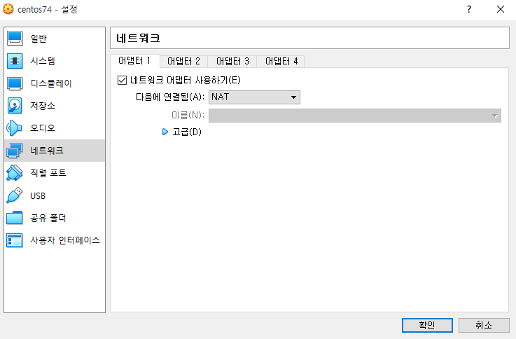

# 가상 머신 네트워크

### NAT

가상 머신 또한 사설 네트워크 단을 통해 IP를 부여 받는 것.

이 경우 host os에서 가상머신을 원격으로 컨트롤 하기 어려워 진다.

### 브릿지

host os의 네트워크 어댑터와 직접 연결된 것처럼 통신하는 방식.

host os가 공유기와 연결되어 있다면 가상머신 또한 공유기의 ip를 받게 된다. 즉 host os 와 동등한 단계의 네트워크 위치를 가질 수 있게 된다.

