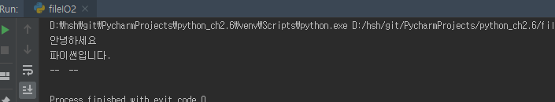

# file I/O

### read

```python
f = open('test.txt', 'rt', encoding='utf-8')
text = f.read()
print(text)

text = f.read()
print('--', text, '--')
```



한번 read를 하면 끝까지 읽고 그 값이 저장된다.


### tell()

파일객체의 파일에서의 현재 위치를 가리키는 정수를 리턴해 준다.


### seek()

파일 객체의 위치를 바꿀 때 사용.

파라미터로 `offset(index 같은거 인듯?)`과 `기준 위치`를 전달할 수 있다. 만약 이동할 `offset`만 전달하면 파일의 시작 위치에서 offset 바이트(단위는 파일에 따라 달리 할 수 있다.) 이동한다. 

기준 위치가 `1`이면, 현재 작업 위치에서 상대적 위치로 양수와 음수 모두 사용할 수 있다. 기준 위치가 `2`이면, 파일의 끝에서 부터 이동한다. 기준위치가 '0'이면 파일의 시작으로 간다.

```python
f.seek(offset, 기준위치)
```


### line 단위로 읽기

- readline()

  ```python
  f2 = open('fileIO2.py', 'rt', encoding='utf-8')
  line_num = 0
  while True:
      line = f2.readline()
      if line == '':
          break
      line_num += 1
      print('{0} : {1} '. format(line_num, line), end='')
  ```

- readlines()

  ```python
  f3 = open('fileIO2.py','rt',encoding='utf-8')
  lines = f3.readlines()
  for line_num, line in enumerate(lines):
      print('{0} : {1} '. format(line_num, line), end='')
  ```

- with ~ as

  ```python
  # with ~ as
  with open('fileIO2.py','rt',encoding='utf-8') as f4:
      for line_num , line in enumerate(f4.readlines()):
          print('{0} : {1} '.format(line_num, line), end='')
  ```

  