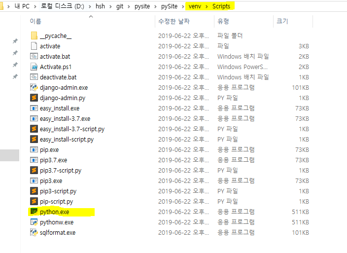
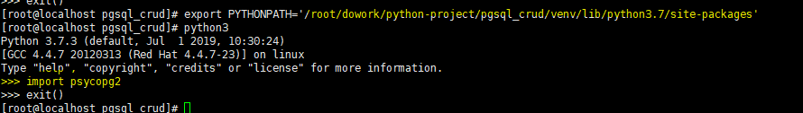
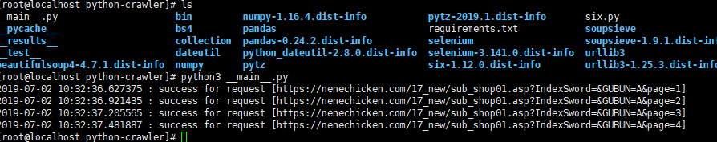
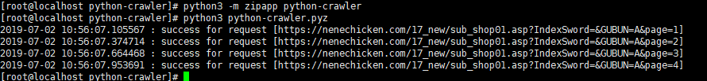

# virtualenv

### 사용하기

1. pip install virtualenv
2. python -m venv [이름]
3. source  [이름]/bin/activate
4. deactivate  --> 빠져나오기

### 삭제하기

그냥 폴더만 삭제하면된당.

### 가상환경에서 파이썬은 어디에 있을까?

가상 환경에서 실행하는 파이썬은 다운로드 받은 파이썬이 아니다. 가상 환경의 `script` 폴더 아래에 있는 파이썬을 실행 시킨다.

### 다시보는 virtualenv

1. 설치

   `# pip3 install virtualenv`

2. 프로젝트 생성 및 가상환경 생성

   해당 프로젝트 dir로 가서

   `# virtualenv [원하는 가상환경 이름]`

3. 가상환경 구동

   `# source  [가상환경 dir]/bin/activate`
   
4. 가상환경에서 나가기

   `# deactivate`

### venv

1. 설치

   `# python3 -m venv [원하는 가상환경 이름]`

2. virtualenv 와 동일

### 의존성 설치

`requirements.txt` 파일에 있는 모듈들만 설치하자!

==> 가상환경에서 `pip install -r requirements.txt`

### 가상 환경 path 추가해서 전역에서 실행하기

`# export PYTHONPATH = '가상환경 library path'`

이렇게 하면 가상환경에서 실행하지 않아도 가상환경에 있는 라이브러리를 사용할 수 도 있다.

but 좋은 방법은 아니다.

### 실제 파이썬 시스템을 배포할 때는

사용자들이 가상환경을 만들고 라이브러리를 설치하게 할 수 는 없다.

따라서 라이브러리를 가상환경(venv ...)에 설치해서 배포하는 것이 아닌, 프로젝트와 같은 경로에 설치(? 저장)해서 배포한다.

A dir에 설치해야할 라이브러리가 저장된 `requirements.txt` 파일이 있다. 이것을 코드만 있는 B dir에 적용하자. 이때 가상환경을 만드는 것이 아니라 모듈 자체를 코드와 같은 수준에 저장한다.

`# pip3 install -r A/requirements.txt --target=B/`

이때 실행은 가상환경이 아니기 때문에 `python3`으로 해야한다.

### 압축해서도 할 수 있다. (packaging)

`# pip3 install -r A/requirements.txt --target=B/` 여기까지는 동일

`# python3 -m zipapp python_crawler`

`# python3 python_crawler.pyz `

