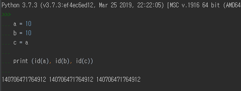
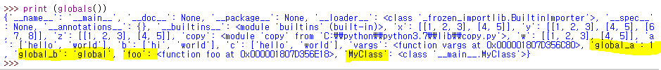
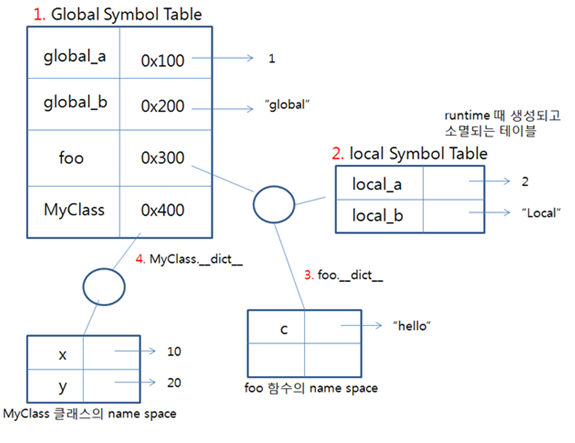

# 객체

파이썬에서 모든 것은 객체이다.

객체가 생성된 후 ID는 변경되지 않으며, 해당객체가 프로그램 실행 중에 유일한 객체라는 것을 보장한다.

파이썬에서는 객체를 비교하기 위해 `id`함수와 `is`연산자가 제공된다.


### id 함수

id함수는 객체를 위한 고유한 상수를 리턴한다. 두 객체의 id함수 리턴값이 같다면 두 객체는 동일한 객체이다.  리턴 값을 객체의 실제 메모리 상의 주소라 보기는 힘드지만 해당 객체를 가리키는 유일한 상수이다. CPython의 경우 실제 메모리 주소를 리턴해 준다.

```python
a = 10
b = 10
c = a

print (id(a), id(b), id(c))
```



다음과 같이 10을 참조하는 `a, b, c`는 모두 같은 `id`를 가진다.


### is 연산자

`a is b`

a, b가 같은 객체라면 (== id 함수의 리턴값이 같다면 ==  동일한 객체를 가리킨다면. )  `True`를 리턴한다.


### is 연산자와 == 의 차이

**is**는 레퍼런스 체크이며, **==**는 값 체크

```python
>>> a = 1
>>> a is 1
True
>>> a == 1
True

>>> id(a)
140706471764624
>>> id(1)
140706471764624
```

`a`와 `1`은 같은 id 값을 가진다. 그래서 `is`연산자를 사용했을때 True가 나온다.

```python
>>> b =257
>>> b is 257
False
>>> b == 257
True

>>> id(b)
2363020827472
>>> id(257)
2363021487856
```

그런데 `257`은 다른 결과를 가져온다.

이 이유는 파이썬 인터프리터가 `[-5,256]` 범위의 integer의 id를 미리 저장하고 있기 때문이다.


## mutable와 immutable

- mutable

  - 객체를 생성한 후, 객체의 값을 수정 가능. 
  - 변수는 값이 수정된 같은 객체를 가리키게 됨.

  - list, set, dict

- immutable

  - 객체를 생성한 후, 객체의 값을 수정 불가능.
  - 변수는 해당 값을 가진 다른 객체를 가리키게 됨.
  - int, float, complex, bool, string, tuple, frozen set

  ```python
  >>> a = 3
  >>> id(a)
  140706471764688
  >>> a= 5
  >>> id(a)
  140706471764752
  >>> a=5
  >>> id(a)
  140706471764752
  ```


### 복사

- 같은 객체

  ```python
  >>> x=[[1,2,3],[4,5]]
  >>> y = x
  >>> y.append([6,7,8])
  >>> x
  [[1, 2, 3], [4, 5], [6, 7, 8]]
  ```

- 얕은 복사  ==> copy()

  ```python
  >>> x=[[1,2,3],[4,5]]
  >>> z = x.copy() # copy.copy(x) 와 같다
  
  >>> hex(id(x))
  '0x1807d2e2b88'
  >>> hex(id(z))
  '0x1807d34e848'
  
  >>> x[0] is z[0]
  True
  
  >>> z.append([6,7,8])
  >>> x
  [[1, 2, 3], [4, 5]]
  ```

  - `z`라는 새로운 객체가 생긴다. 하지만 `z`의 원소는 `x`의 원소와 같은 곳을 가리킨다.

- 깊은 복사 ==> deepcopy()

  ```python
  >>> import copy
  >>> w = copy.deepcopy(x)
  >>> x is w
  False
  >>> x[0] is w[0]
  False
  ```

  - 객체 내부의 객체들 까지 모두 새롭게 copy된다.

깊은 복사가 복합객체만을 생성하기 때문에, 복합객체가 한개만 있는 경우에는 얕은 복사, 깊은복사는 차이가 없다. ==> 얕은 복사 수행

```python
>>> a=["hello","world"]
>>> b=copy.copy(a)
>>> c=copy.deepcopy(a)
>>> b[0] is a[0]
True
>>> c[0] is a[0]
True
>>> c[0] is b[0]
>>> b[0] = "hi"
>>> a
['hello', 'world']
>>> b
['hi', 'world']
>>> c
['hello', 'world']
```


## 심볼 테이블

변수는 단지 객체의 이름일 뿐인데, 이를 심볼이라 한다.

파이썬에서는 이름과 레퍼런스를 저장하는 테이블이 있는데 이를 **심볼 테이블**이라 한다.

- 변수의 이름과 데이터의 주소를 저장하는 테이블

- 심볼 테이블의 내용을 살펴보기 위해서는 **globals()**, **locals()** 내장 함수를 사용하며, 함수 호출로 반환된 테이블은 스코프(scope)를 나타낸다. ==> (global table, local table)

  그리고 테이블의 내용은 dict 객체로 반환된다.


심볼 테이블은 객체의 이름과 주소가 함께 저장되어 관계를 가진다.

또한 객체마다 심볼 테이블이 존재하여 객체에서만 사용할 수 있는 변수를 정의할 수 있다.

객체의 심볼 테이블은 객체가 존재하는 동안 생겼다가 사라지는 테이블이다.


심볼 테이블이 존재한다는 것은 객체의 확장이 가능하나는 의미이다. 따라서 파이썬의 내장 객체가 아닌 개발자가 생성한 객체는 동적으로 변수를 추가할 수 있다.

반면 내장 함수는 심볼 테이블이 존재하지 않으며, 내장 클래스의 객체(str, tuple ..)는 심볼 테이블이 존재하지만 확장이 불가능 하다.

```python
>>> print(print.__dict__)
Traceback (most recent call last):
  File "<pyshell#79>", line 1, in <module>
    print(print.__dict__)
AttributeError: 'builtin_function_or_method' object has no attribute '__dict__'
```

내장함수 `print`의 네임 스페이스를 확인하려하니 `__dict__`라는 속성이 없다고 한다.

```python
>>> 
>>> str.a = 'foo'
Traceback (most recent call last):
  File "<pyshell#82>", line 1, in <module>
    str.a = 'foo'
TypeError: can't set attributes of built-in/extension type 'str'
```

내장 객체 `str`에 속성을 추가하려고 하니 할 수 없다고 한다.


### 예제

```python
>>> global_a = 1
>>> global_b = 'global'
>>> 
>>> def foo():
	local_a = 2
	local_b = 'local'
	print(locals())

	
>>> class MyClass :
	x = 10
	y = 20
```



`global symbol table`에는 다음과 같이 `global_a`, `global_b`, `foo`, `MyClass`의 정보가 담겨 있다. 이때 레퍼런스 값에는 해당 값들의 주소값이 저장된다.



<https://webnautes.tistory.com/1181>

<https://tech.songyunseop.com/post/2017/09/python-comparing/>

<https://victorydntmd.tistory.com/241>


### 변수란?

파이썬에서 사용하는 변수는 결국 객체이다.

```python
a = 3
```

위의 코드처럼 a=3이라고 하면 3이라는 값을 가지는 정수 자료형(==객체)이 자동으로 메모리에 생성된다. ** a는 변수의 이름이며, 3이라는 정수형 객체가 저장된 메모리 위치를 가리키게 된다.** 즉 변수 a는 객체가 저장된 메모리의 위치를 가리키는 레퍼런스라고도 할 수 있다. 쉽게 말하면 a라는 변수는 3이라는 정수형 객체를 가리키고 있다.


### "3"은 상수가 아닌 정수형 객체이다.

```python
>>> type(3)
<class 'int'>
```


다음 예를 보자

```python
>>> a = 3
>>> b = 3
>>> a is b
True
```

a가 3을 가리키고 b도 3을 가리킨다. 즉 a=3을 입력하는 순간 3이라는 정수형 객체가 생성되고 (?? 맞는감) 변수 a는 3이라는 객체의 메모리 주소를 가리킨다. 다음에 변수 b가 동일한 객체인 3을 가리킨다. 이제 3이라는 정수형 객체를 가리키는 변수가 2개가 된 것. 이 두 변수는 가리키고 있는 대상이 동일하다. 따라서 동일한 객체를 가리키고 있는지 아닌지에 대해서 판단하는 is 함수를 실행했을 때 True를 리턴한다.


<https://sshkim.tistory.com/156>