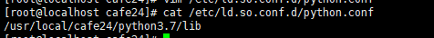
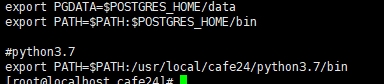

# 설치파일로 설치하기 in CentOS(6.9)

yum install이 아닌 설치파일로 직접 설치해보자!

### 1. 기본 라이브러리 설치

`# yum -y install openssl`

openssl의 다른 버전은 libressl이다. (??)

파이썬3.7.x에서는 libressl 2.6 이상이 필요하다.

`# yum -y install openssl-devel`

`# yum -y install bzip2-devel`

`# yum -y install sqlite-devel`

`# yum -y install zlib-devel`

`# yum -y install libffi-devel`

### 2. 파이썬 3.73 설치

1. 파이썬 파일 다운

   `# wget https://www.python.org/ftp/python/3.7.3/Python-3.7.3.tgz`

   `# tar -xvzf Python-3.7.3`

   `# cd Python-3.7.3`
   
2. 경로 및 환경 설정

   `# ./configure --prefix=/usr/local/cafe24/python3.7.3 --with-openssl=/ssl경로 --enable-shared`

3. 빌드

   `# make && make install`

4. 공유 라이브러리 로딩 설정

   ​	` # vi /etc/ls.so.conf.d/python.conf`

   

   ​	파이썬 `lib` 경로를 입력

    	나의 경우는 `python3.7.3`을 `python 3.7`으로 ln 명령어를 통해 link 시켜줬다.

   ​	`# ldconfig -v | grep python` 으로 확인

5. path에 파이썬 추가

   `# vi /etc/profile`

   

   `# source /etc/profil` 로 수정된 스크립트 파일의 값을 바로 적용.

6. 확인

   `# python3`로 작동되는지, 버전은 맞는지 확인하자

### 3. Python Isolation Tools (Virtual Environments)

1. venv : python3.3 버전 이후 부터 기본 모듈
2. virtualenv : python2 부터 사용해오던 가상환경 라이브러리
3. pyenv : python interpretor version manager
4. conda : Anaconda python 설치했을 때 사용
5. etc : 기타 등등 많다.
