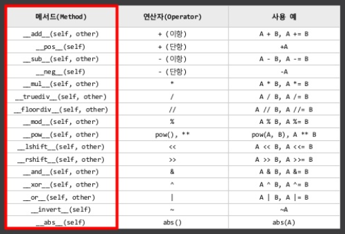

# 연산자 오버로딩

직접 정의한 클래스에 의해 생성된 객체는 기본적으로 연산이 불가능하다.

```python
class Number:
    def __init__(self, n):
        self.n = n
        
n1 = Number(2)
n2 = Number(3)

print(n1+n2)
```

객체는 연산 가능한 상태로 만들기 위해 **연산자 오버로딩**을 사용하여 이를 구현한다.


### 정의

어떠한 연산자와 함수의 동작을 똑같이 수행하는 메소드.

이러한 연산자를 메소드로 정의하는 것을 연산자 오버로딩이라 부른다.

- 연산자 오버로딩은 개발자가 정의내린 메소드에 내장 연산자(built-in operator)를 사용하여 정의 한다.

- 메소드 앞 뒤에 `__`를 이용하여 정의한다.
- `__`이 있다고 해서 이 메소드가 private인 것은 아니다.


### 연산자와 특수 메소드



파이썬에서는 이미 다음과 같이 연산자와 메소드를 매핑시켜져 있다.

따라서 객체에  '+'연산자를 적용하고 싶으면 `__add__` 메소드를 구현하면 된다.

<https://andamiro25.tistory.com/50>

[https://planbs.tistory.com/entry/Python-%EC%97%B0%EC%82%B0%EC%9E%90-%EC%98%A4%EB%B2%84%EB%A1%9C%EB%94%A9](https://planbs.tistory.com/entry/Python-연산자-오버로딩)